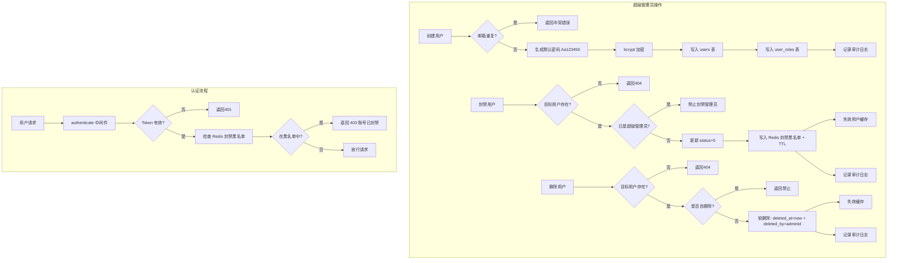
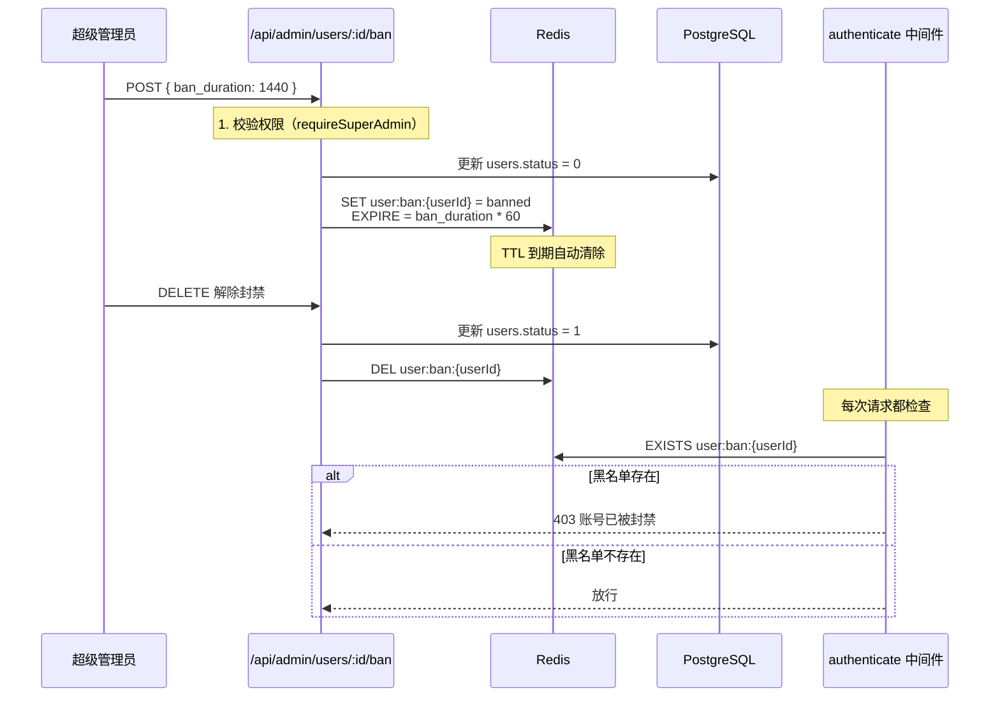

# 用户管理系统 — 用户列表模块方案设计文档

> **文档版本**: v1.0  
> **创建日期**: 2026-06-24  
> **前置文档**: [1.auth-system-design.md](./1.auth-system-design.md)、[2.user-module-optimization.md](./2.user-module-optimization.md)、[3.type-definitions.md](./3.type-definitions.md)  
> **适用项目**: FormForge系统 (questionnaireSys)  
> **目标模块**: `app/q-server/src/modules/user`

---

## 目录

1. [需求分析](#1-需求分析)
2. [现有实现对比分析](#2-现有实现对比分析)
3. [系统设计](#3-系统设计)
4. [数据模型设计](#4-数据模型设计)
5. [Redis 缓存设计](#5-redis-缓存设计)
6. [API 接口定义](#6-api-接口定义)
7. [安全策略](#7-安全策略)
8. [实现计划](#8-实现计划)

---

## 1. 需求分析

### 1.1 业务背景

当前 `admin.service.ts` 已实现基础的超级管理员用户 CRUD（创建、列表、更新、软删除），但仍有以下能力缺口需要补齐：

| 缺口项       | 现状                                 | 目标                                          |
| ------------ | ------------------------------------ | --------------------------------------------- |
| **用户创建** | 需同时传email/username/role/password | 简化为仅需 username + email，默认密码自动生成 |
| **用户封禁** | 不存在                               | 基于期限的封禁机制，Redis 黑名单管理          |
| **用户删除** | 软删除未记录操作人                   | 增加 `deleted_by` 字段，预留定时清理扩展点    |
| **权限控制** | 超级管理员 / 普通用户                | 维持现状，CRUD 仅限超级管理员                 |

### 1.2 核心业务流程图



### 1.3 需求规格说明

| 编号  | 需求项       | 优先级 | 说明                                                                                    |
| ----- | ------------ | ------ | --------------------------------------------------------------------------------------- |
| R-001 | 简化用户创建 | 高     | 参数收敛为 `username` + `email`，角色默认为 `user`，密码默认为符合强度校验的 `Aa123456` |
| R-002 | 用户封禁     | 高     | 支持设定封禁期限（分钟/小时/天），Redis 维护黑名单，封禁用户所有请求均被中间件拦截      |
| R-003 | 解除封禁     | 高     | 管理员可手动解除封禁，清除 Redis 记录                                                   |
| R-004 | 封禁状态查询 | 中     | 用户列表/详情中展示封禁状态与剩余时间                                                   |
| R-005 | 删除增强     | 高     | `users` 表新增 `deleted_by` 字段，记录删除操作人；定义 `HardDeleteService` 接口规范     |
| R-006 | 权限控制     | 高     | 所有用户管理接口仅限超级管理员访问，普通用户无任何用户管理权限                          |

---

## 2. 现有实现对比分析

### 2.1 模块结构现状

```
app/q-server/src/modules/user/
├── index.ts                         # 统一导出
├── schemas/
│   └── user.schemas.ts              # Zod Schema 定义
├── auth/
│   ├── auth.routes.ts               # /api/auth/* 认证路由
│   ├── auth.service.ts              # 认证核心业务
│   └── auth.middleware.ts            # authenticate / requireSuperAdmin
├── admin/
│   ├── admin.routes.ts              # /api/admin/* 管理路由 ← 本次改造重点
│   └── admin.service.ts             # 管理员服务 ← 本次改造重点
├── profile/
│   ├── profile.routes.ts            # /api/user/profile/* 资料路由
│   ├── profile.service.ts           # 资料服务
│   └── avatar.service.ts            # 头像服务
└── user-crud/
    ├── user-crud.routes.ts          # /api/user/* 个人信息路由
    └── user-crud.service.ts         # 个人信息服务
```

### 2.2 现有接口 vs 需求接口对照

| 现有接口                              | 需求匹配度 | 改造策略                                                               |
| ------------------------------------- | ---------- | ---------------------------------------------------------------------- |
| `POST /api/admin/users`               | 需调整     | createUserSchema 简化：移除必填 role，password 改为可选 → 统一默认策略 |
| `GET /api/admin/users`                | 需增强     | 列表增加封禁状态字段、封禁剩余时间；支持按封禁状态筛选                 |
| `PUT /api/admin/users/:id`            | 需增强     | 支持传入封禁期限参数；角色变更增加保护（不允许将唯一超级管理员降级）   |
| `DELETE /api/admin/users/:id`         | 需增强     | 增加 `deleted_by` 写入                                                 |
| `PUT /api/admin/config/smtp`          | 无需变更   | 保持现状                                                               |
| `GET /api/admin/config`               | 无需变更   | 保持现状                                                               |
| **`POST /api/admin/users/:id/ban`**   | **新增**   | 封禁用户接口，参数：ban_duration（分钟）                               |
| **`DELETE /api/admin/users/:id/ban`** | **新增**   | 解除封禁接口                                                           |

### 2.3 现有 createUser 流程分析

现有代码（`admin.service.ts`）`createUser` 方法：

```typescript
// 现有逻辑 — 参数较多
async createUser(adminId: bigint, input: CreateUserInput) {
  // CreateUserInput: { email, username, role, password? }
  // 未提供密码时 → 随机生成 12 位包含特殊字符的密码
  const password = input.password ?? this.generateRandomPassword(12);
  // ...
}
```

**问题点**：

- 参数冗余：`role` 应为后端默认决定（普通用户 = `user`）
- 随机密码生成过于复杂：`generateRandomPassword(12)` 产生含特殊字符的字符串，对管理员不友好
- 业务语义不清：创建用户时应自动赋予 `user` 角色，不应由调用方指定

**改造方案**：

- Schema 收敛：仅接收 `username` + `email`，`role` 移出 Schema
- 默认密码策略：使用符合 `passwordSchema` 校验的最简密码 `Aa123456`（含大小写字母 + 数字 + ≥8位）
- 密码安全增强：首次登录强制修改密码（通过 Redis 标记 `user:first_login:{userId}`，在 `verifyToken` 中返回标记位，前端引导修改密码）

---

## 3. 系统设计

### 3.1 分层架构

```mermaid
flowchart LR
    subgraph Route["路由层 (admin.routes.ts)"]
        R1[POST /users]
        R2[GET /users]
        R3[PUT /users/:id]
        R4[DELETE /users/:id]
        R5[POST /users/:id/ban]
        R6[DELETE /users/:id/ban]
    end

    subgraph Middleware["中间件层"]
        M1[authenticate]
        M2[requireSuperAdmin]
        M3[checkBanStatus -- 新增]
    end

    subgraph Service["服务层 (admin.service.ts)"]
        S1[createUser]
        S2[listUsers]
        S3[updateUser]
        S4[deleteUser]
        S5[banUser -- 新增]
        S6[unbanUser -- 新增]
    end

    subgraph Cache["缓存层"]
        C1[Redis 角色缓存]
        C2[Redis 封禁黑名单 -- 新增]
        C3[Redis 用户列表缓存]
    end

    subgraph DB["数据层"]
        D1[(PostgreSQL users)]
        D2[(PostgreSQL user_roles)]
        D3[(PostgreSQL audit_logs)]
    end

    Route --> Middleware
    Middleware --> Service
    Service --> Cache
    Service --> DB
```



### 3.2 封禁机制设计

封禁采用 **Redis 黑名单 + 数据库双注册** 策略，确保高可用：



**设计决策**：

| 决策点               | 选择                         | 理由                                       |
| -------------------- | ---------------------------- | ------------------------------------------ |
| 封禁状态存储         | Redis（主）+ DB status（辅） | Redis 提供 O(1) 查询；DB 提供持久化兜底    |
| TTL 机制             | Redis `SET … EX` 原生过期    | 无需后台定时任务，自动过期释放             |
| 封禁用户拦截位置     | `authenticate` 中间件内部    | 认证之后、业务之前，最小侵入               |
| 超级管理员是否可封禁 | 禁止                         | 防止系统"锁死"，确保至少一个超级管理员存活 |

### 3.3 删除增强设计

```
现有软删除流程：
  users.deleted_at = NOW()                                     ← 已实现
  audit_logs 记录 (createAuditLog)                             ← 已实现
  缓存失效                                                      ← 已实现

本次增强：
  users.deleted_by = adminId          ← 新增字段，记录操作人
  HardDeleteService 接口规范          ← 预留扩展点

定时清理扩展点接口（本次仅定义接口，不实现）：
  interface IHardDeleteService {
    /** 清理超过 retentionDays 的已删除用户数据 */
    cleanExpiredUsers(retentionDays: number): Promise<number>;
  }
```

---

## 4. 数据模型设计

### 4.1 users 表变更

> 基于现有 `prisma/schema.prisma` 中 `User` 模型进行最小化变更

```prisma
model User {
  id            BigInt    @id @default(autoincrement())
  email         String    @unique
  password_hash String
  username      String
  role          String    @default("user")       // "admin" / "user"
  avatar_url    String?
  status        Int       @default(1)            // 0:禁用 1:启用（含封禁）
  created_at    DateTime  @default(now())
  updated_at    DateTime  @updatedAt
  last_login_at DateTime?
  deleted_at    DateTime?                        // 软删除时间
  deleted_by    BigInt?                          // ★ 新增：删除操作人 ID

  // ... 关联关系保持不变
  @@index([deleted_by])                          // ★ 新增：按操作人查询
}
```

### 4.2 新增 Migration

```sql
-- migration.sql
ALTER TABLE users ADD COLUMN deleted_by BIGINT;
CREATE INDEX idx_users_deleted_by ON users(deleted_by);
```

### 4.3 与现有字段对比

| 字段         | 现有 | 新增     | 说明                          |
| ------------ | ---- | -------- | ----------------------------- |
| `deleted_at` | 已有 | —        | 软删除时间，保持不变          |
| `deleted_by` | —    | **新增** | 记录删除操作人 ID             |
| `status`     | 已有 | —        | 0=禁用/封禁，1=启用，复用现有 |

**设计说明**：不新增独立的 `ban_status` / `ban_until` 字段，而是：

- `status = 0` 表示禁用（含封禁场景），与现有逻辑完全兼容
- 封禁的"期限"信息存储在 Redis `user:ban:{userId}` 中，通过 `TTL` 查询剩余时间
- 这避免了数据库字段膨胀，同时 Redis TTL 提供天然的过期管理

---

## 5. Redis 缓存设计

### 5.1 新增缓存 Key

```typescript
// 在 src/utils/cache.ts 的 CacheKeys 中新增

export const CacheKeys = {
  // ... 现有 Key 保持不变

  // ─── 用户封禁模块（新增） ──────────────────────────────────
  /** 用户封禁黑名单（value 任意非空字符串，TTL = 封禁期限） */
  userBanStatus: (userId: string) => `user:ban:${userId}`,

  /** 用户首次登录标记（value = "1"，TTL = 7天） */
  userFirstLogin: (userId: string) => `user:first_login:${userId}`
} as const;
```

### 5.2 封禁黑名单生命周期

```
创建封禁：
  SET user:ban:{userId} "banned" EX {ban_duration_seconds}

查询封禁状态：
  EXISTS user:ban:{userId}        → 1 = 已封禁, 0 = 未封禁
  TTL user:ban:{userId}           → 剩余封禁秒数（-1=永久, -2=不存在）

到期自动释放：
  Redis 原生 TTL 过期 → Key 自动删除 → 无需任何后台任务

手动解除：
  DEL user:ban:{userId}
  同时更新 DB: users.status = 1
```

### 5.3 中间件拦截逻辑

```typescript
// 在 auth.middleware.ts 的 authenticate 函数中新增封禁检查

export async function authenticate(request: FastifyRequest, _reply: FastifyReply) {
  // ... 现有 Token 校验逻辑

  // ★ 新增：检查封禁状态
  const userIdStr = request.user!.userId.toString();
  const redis = request.server.redis;

  try {
    const isBanned = await redis.exists(`user:ban:${userIdStr}`);
    if (isBanned) {
      // 获取剩余封禁时间返回给前端
      const banRemaining = await redis.ttl(`user:ban:${userIdStr}`);
      throw new AuthError(`账号已被封禁，剩余 ${formatBanDuration(banRemaining)}`, 403);
    }
  } catch (err) {
    if (err instanceof AuthError) throw err;
    // Redis 不可用时不阻塞正常请求（降级策略）
    request.log.warn("封禁状态检查失败，降级放行");
  }
}
```

---

## 6. API 接口定义

> Base URL: `http://<host>:<port>/api/admin`  
> 所有接口需 `Authorization: Bearer <token>` + 超级管理员权限  
> 认证方式：`authenticate` + `requireSuperAdmin` 双中间件

### 6.1 创建用户（调整）

```
POST /api/admin/users
```

**请求体**：

```json
{
  "username": "张三",
  "email": "zhangsan@example.com"
}
```

| 参数     | 类型   | 必填 | 说明                  |
| -------- | ------ | ---- | --------------------- |
| username | string | 是   | 用户名，1-50 字符     |
| email    | string | 是   | 邮箱，需符合 RFC 5322 |

**成功响应**：

```json
{
  "data": {
    "id": "42",
    "email": "zhangsan@example.com",
    "username": "张三",
    "role": "user",
    "status": 1,
    "defaultPassword": "Aa123456",
    "requirePasswordChange": true
  },
  "code": 0,
  "msg": "用户创建成功"
}
```

| 字段                  | 类型    | 说明                                                     |
| --------------------- | ------- | -------------------------------------------------------- |
| defaultPassword       | string  | 默认密码明文（仅在创建响应中返回一次，建议前端提示保存） |
| requirePasswordChange | boolean | 是否要求首次登录修改密码                                 |

**错误响应**：

| code | msg                       | 说明         |
| ---- | ------------------------- | ------------ |
| 1001 | 该邮箱已被注册            | 邮箱冲突     |
| 400  | 用户名不能为空 / 格式错误 | 参数校验失败 |

### 6.2 用户列表（增强）

```
GET /api/admin/users?page=1&limit=20&email=&status=&ban_status=
```

| 参数       | 类型   | 必填 | 说明                                                      |
| ---------- | ------ | ---- | --------------------------------------------------------- |
| page       | number | 否   | 页码，默认 1                                              |
| limit      | number | 否   | 每页条数，默认 20，最大 100                               |
| email      | string | 否   | 邮箱模糊搜索                                              |
| status     | number | 否   | 0=禁用 1=启用                                             |
| ban_status | string | 否   | ★ 新增：`banned`（仅封禁）/ `active`（仅活跃）/ 不传=全部 |

**成功响应**：

```json
{
  "data": {
    "items": [
      {
        "id": "42",
        "email": "zhangsan@example.com",
        "username": "张三",
        "role": "user",
        "status": 1,
        "isBanned": false,
        "banRemaining": null,
        "isDeleted": false,
        "created_at": "2026-06-24T10:00:00.000Z",
        "last_login_at": null
      }
    ],
    "total": 1,
    "page": 1,
    "limit": 20,
    "totalPages": 1
  },
  "code": 0,
  "msg": "ok"
}
```

| 字段         | 类型         | 说明                              |
| ------------ | ------------ | --------------------------------- |
| isBanned     | boolean      | ★ 新增：是否处于封禁状态          |
| banRemaining | number\|null | ★ 新增：封禁剩余秒数，null=未封禁 |
| isDeleted    | boolean      | ★ 新增：是否已被软删除            |

### 6.3 封禁用户（新增）

```
POST /api/admin/users/:id/ban
```

**请求体**：

```json
{
  "ban_duration": 1440,
  "reason": "发布违规内容"
}
```

| 参数         | 类型   | 必填 | 说明                                    |
| ------------ | ------ | ---- | --------------------------------------- |
| ban_duration | number | 是   | 封禁时长（分钟），范围 1-43200（30 天） |
| reason       | string | 否   | 封禁原因，最大 500 字符                 |

**成功响应**：

```json
{
  "data": {
    "id": "42",
    "username": "张三",
    "isBanned": true,
    "banRemaining": 86400,
    "bannedUntil": "2026-06-25T10:00:00.000Z"
  },
  "code": 0,
  "msg": "用户已被封禁"
}
```

**错误响应**：

| code | msg                | 说明        |
| ---- | ------------------ | ----------- |
| 404  | 用户不存在         |             |
| 403  | 不能封禁超级管理员 | 保护机制    |
| 400  | 封禁时长超限       | >43200 分钟 |

### 6.4 解除封禁（新增）

```
DELETE /api/admin/users/:id/ban
```

**成功响应**：

```json
{
  "data": {
    "id": "42",
    "username": "张三",
    "isBanned": false
  },
  "code": 0,
  "msg": "封禁已解除"
}
```

### 6.5 删除用户（增强）

```
DELETE /api/admin/users/:id
```

**与现有差异**：

- 响应新增 `deletedBy` 字段
- 数据库写入 `deleted_by` 字段

**成功响应**：

```json
{
  "data": {
    "id": "42",
    "deleted": true,
    "deletedBy": "1",
    "deletedAt": "2026-06-24T12:00:00.000Z"
  },
  "code": 0,
  "msg": "用户已删除"
}
```

### 6.6 完整路由表

| 方法     | 路径             | 状态     | 说明                          |
| -------- | ---------------- | -------- | ----------------------------- |
| `POST`   | `/users`         | **调整** | 创建用户（参数简化）          |
| `GET`    | `/users`         | **调整** | 用户列表（增加封禁字段）      |
| `PUT`    | `/users/:id`     | 保持     | 更新用户信息                  |
| `DELETE` | `/users/:id`     | **调整** | 软删除用户（增加 deleted_by） |
| `POST`   | `/users/:id/ban` | **新增** | 封禁用户                      |
| `DELETE` | `/users/:id/ban` | **新增** | 解除封禁                      |
| `GET`    | `/config`        | 保持     | 获取系统配置                  |
| `PUT`    | `/config/smtp`   | 保持     | 更新 SMTP 配置                |

---

## 7. 安全策略

### 7.1 权限控制矩阵

| 操作         | 超级管理员 | 普通用户 | 未登录用户 |
| ------------ | ---------- | -------- | ---------- |
| 创建用户     | ✅         | ❌       | ❌         |
| 查看用户列表 | ✅         | ❌       | ❌         |
| 更新用户     | ✅         | ❌       | ❌         |
| 删除用户     | ✅         | ❌       | ❌         |
| 封禁用户     | ✅         | ❌       | ❌         |
| 解除封禁     | ✅         | ❌       | ❌         |
| 系统配置管理 | ✅         | ❌       | ❌         |
| 查看个人信息 | ✅         | ✅       | ❌         |
| 更新个人信息 | ✅         | ✅       | ❌         |

### 7.2 防护措施

| 防护点               | 机制                                       | 说明                                             |
| -------------------- | ------------------------------------------ | ------------------------------------------------ |
| **密码强度**         | Zod Schema 校验                            | 默认密码 `Aa123456` 符合规则（大小写+数字+≥8位） |
| **首次登录强制改密** | Redis 标记 `user:first_login:{userId}`     | 前端根据标记引导修改密码                         |
| **邮箱唯一性**       | 数据库 UNIQUE 约束 + 应用层前置检查        | 创建前查重                                       |
| **封禁拦截**         | authenticate 中间件内 Redis 黑名单检查     | O(1) 性能，不影响正常请求                        |
| **Redis 降级**       | try-catch 包裹，Redis 不可用时放行         | 保障服务可用性                                   |
| **超级管理员保护**   | 禁止封禁/删除自身 + 禁止封禁唯一超级管理员 | 防止系统锁死                                     |
| **速率限制**         | 复用现有 `@fastify/rate-limit` 配置        | 默认全局限流已生效                               |
| **审计追踪**         | audit_logs 记录所有管理操作                | 操作可追溯                                       |

### 7.3 Zod Schema 新增定义

```typescript
// 在 schemas/user.schemas.ts 中新增

/** POST /api/admin/users — 简化版创建用户 */
export const createUserSchema = z.object({
  username: usernameSchema,
  email: emailSchema
});

/** POST /api/admin/users/:id/ban */
export const banUserSchema = z.object({
  ban_duration: z.number().int().min(1, "封禁时长至少1分钟").max(43200, "封禁时长不能超过30天"), // 43200 分钟 = 30 天
  reason: z.string().max(500, "封禁原因最多500个字符").optional()
});

/** GET /api/admin/users — 扩展查询参数 */
export const userListQuerySchema = paginationSchema.extend({
  email: z.string().optional(),
  status: z.coerce.number().int().min(0).max(1).optional(),
  ban_status: z.enum(["banned", "active"]).optional() // ★ 新增
});
```

---

## 8. 实现计划

### 8.1 文件变更清单

| 文件路径                                                                    | 操作     | 说明                                                                                       |
| --------------------------------------------------------------------------- | -------- | ------------------------------------------------------------------------------------------ |
| `src/modules/user/schemas/user.schemas.ts`                                  | **修改** | 简化 createUserSchema，新增 banUserSchema、userListQuerySchema 新增 ban_status             |
| `src/modules/user/admin/admin.routes.ts`                                    | **修改** | 新增 POST /users/:id/ban、DELETE /users/:id/ban 路由；调整 create/list/delete 路由         |
| `src/modules/user/admin/admin.service.ts`                                   | **修改** | 新增 banUser/unbanUser 方法；调整 createUser 默认密码策略；调整 deleteUser 写入 deleted_by |
| `src/modules/user/auth/auth.middleware.ts`                                  | **修改** | authenticate 中间件新增封禁状态检查                                                        |
| `src/utils/cache.ts`                                                        | **修改** | CacheKeys 新增 userBanStatus、userFirstLogin                                               |
| `prisma/schema.prisma`                                                      | **修改** | User 模型新增 deleted_by 字段                                                              |
| `prisma/migrations/YYYYMMDDHHMMSS_add_user_ban_and_delete_by/migration.sql` | **新增** | Migration 文件                                                                             |

### 8.2 实现步骤

```
Phase 1: 数据模型变更
  ├── [1.1] prisma/schema.prisma — User 模型新增 deleted_by
  ├── [1.2] 生成 Migration
  └── [1.3] 执行迁移

Phase 2: 基础层变更
  ├── [2.1] src/utils/cache.ts — 新增 CacheKeys.userBanStatus / userFirstLogin
  ├── [2.2] src/modules/user/schemas/user.schemas.ts — 调整 + 新增 Schema
  └── [2.3] src/modules/user/auth/auth.middleware.ts — 新增封禁中间件检查

Phase 3: 服务层变更
  ├── [3.1] admin.service.ts — createUser 默认密码策略调整
  ├── [3.2] admin.service.ts — banUser 方法实现
  ├── [3.3] admin.service.ts — unbanUser 方法实现
  ├── [3.4] admin.service.ts — listUsers 增加封禁状态字段
  ├── [3.5] admin.service.ts — deleteUser 增加 deleted_by 写入
  └── [3.6] admin.service.ts — 超级管理员保护逻辑（不能封禁/删除唯一管理员）

Phase 4: 路由层变更
  ├── [4.1] admin.routes.ts — 调整 POST /users 路由
  ├── [4.2] admin.routes.ts — 新增 POST /users/:id/ban 路由
  ├── [4.3] admin.routes.ts — 新增 DELETE /users/:id/ban 路由
  ├── [4.4] admin.routes.ts — 调整 DELETE /users/:id 路由（响应增强）
  └── [4.5] admin.routes.ts — 调整 GET /users 路由（查询参数增强）

Phase 5: 扩展接口定义（预留，本次不实现）
  └── [5.1] 定义 HardDeleteService 接口规范（TypeScript interface + 注释）
```

### 8.3 关键代码设计

#### 8.3.1 banUser 方法签名

```typescript
// admin.service.ts

interface BanUserInput {
  ban_duration: number;  // 分钟
  reason?: string;
}

interface BanUserResult {
  id: string;
  username: string;
  isBanned: boolean;
  banRemaining: number;  // 秒
  bannedUntil: string;   // ISO 8601
}

async banUser(adminId: bigint, targetId: bigint, input: BanUserInput): Promise<BanUserResult>
```

#### 8.3.2 首次登录标记

```typescript
// admin.service.ts — createUser 末尾追加

// 标记首次登录，7 天内有效
const banSeconds = input.ban_duration * 60;
await this.cache.set(CacheKeys.userFirstLogin(user.id.toString()), "1", 7 * 24 * 3600);
```

#### 8.3.3 封禁状态聚合（listUsers 增强）

```typescript
// admin.service.ts — listUsers 中为每个用户查询 Redis 封禁状态

// 批量查询 Redis 封禁状态（使用 pipeline 提升性能）
const banStatusMap = new Map<string, { isBanned: boolean; banRemaining: number | null }>();

// 仅当 ban_status 参数未指定或为 "banned" 时查询
if (query.ban_status !== "active") {
  const pipeline = this.fastify.redis.pipeline();
  for (const u of items) {
    const key = CacheKeys.userBanStatus(u.id.toString());
    pipeline.ttl(key);
  }
  const results = await pipeline.exec();
  // 解析结果...
}

return paginatedResult(
  items.map(u => ({
    ...u,
    id: u.id.toString(),
    isBanned: banStatusMap.get(u.id.toString())?.isBanned ?? false,
    banRemaining: banStatusMap.get(u.id.toString())?.banRemaining ?? null,
    isDeleted: false
  })),
  total,
  { page: query.page, pageSize: query.limit }
);
```

### 8.4 风险与注意事项

| 风险点                     | 影响                 | 缓解措施                                                    |
| -------------------------- | -------------------- | ----------------------------------------------------------- |
| Redis 不可用时封禁失效     | 封禁用户可能正常访问 | authenticate 中间件 try-catch 降级；补充 DB status 兜底检查 |
| 默认密码泄露               | 安全风险             | 首次登录强制改密；响应中明文密码仅返回一次                  |
| Migration 失败             | 服务不可用           | 先在 staging 环境验证；deleted_by 允许 NULL                 |
| 封禁后已有 Token 仍有效    | 安全风险             | authenticate 中间件实时检查 Redis，封禁立即生效             |
| 列表页 Redis Pipeline 超时 | 接口变慢             | 设置 Pipeline 超时；大量用户时改为分批查询                  |

---

## 附录

### A. 与现有模块的关系

```
src/modules/user/
├── auth/              ← 不变（登录、注册、Token、验证码）
├── profile/           ← 不变（资料 CRUD、头像、邮箱绑定）
├── user-crud/         ← 不变（当前用户信息查询、更新）
├── admin/             ← ★ 本次改造
│   ├── admin.routes.ts   → 新增 ban/unban 路由，调整 create/list/delete
│   └── admin.service.ts  → 新增 banUser/unbanUser，调整 createUser/deleteUser/listUsers
└── schemas/
    └── user.schemas.ts   → 简化 createUserSchema，新增 banUserSchema
```

### B. 关键设计决策记录

| 编号 | 决策                                      | 决策人 | 日期       |
| ---- | ----------------------------------------- | ------ | ---------- |
| D-01 | 封禁状态主存储用 Redis，DB status 兜底    | —      | 2026-06-24 |
| D-02 | 默认密码使用 "Aa123456" 符合强度校验      | —      | 2026-06-24 |
| D-03 | 首次登录强制改密通过 Redis 标记实现       | —      | 2026-06-24 |
| D-04 | 超级管理员禁止被封禁/删除自身             | —      | 2026-06-24 |
| D-05 | 不新增 ban_status 数据库字段，复用 status | —      | 2026-06-24 |
