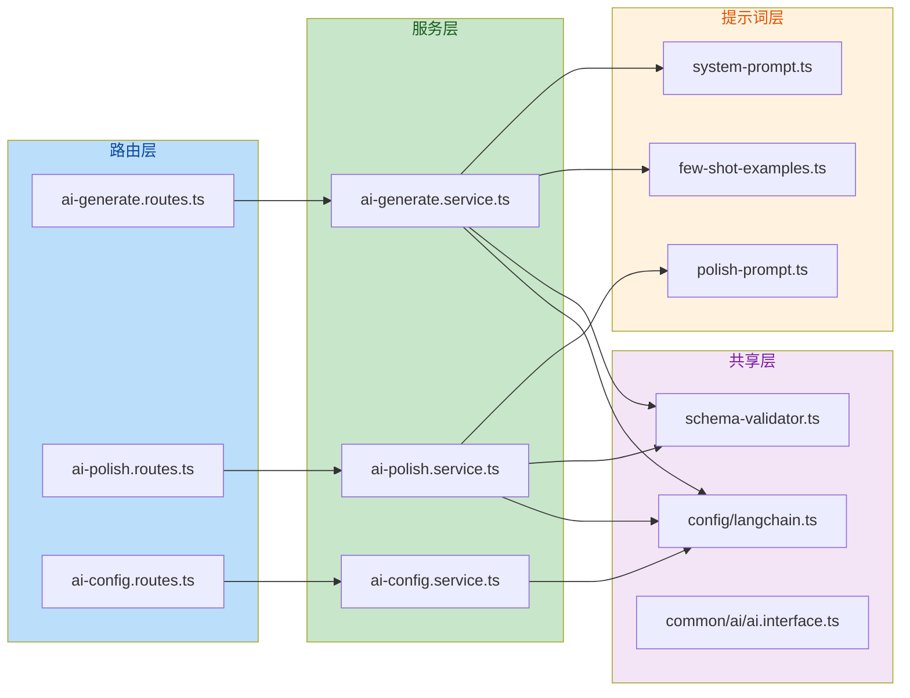
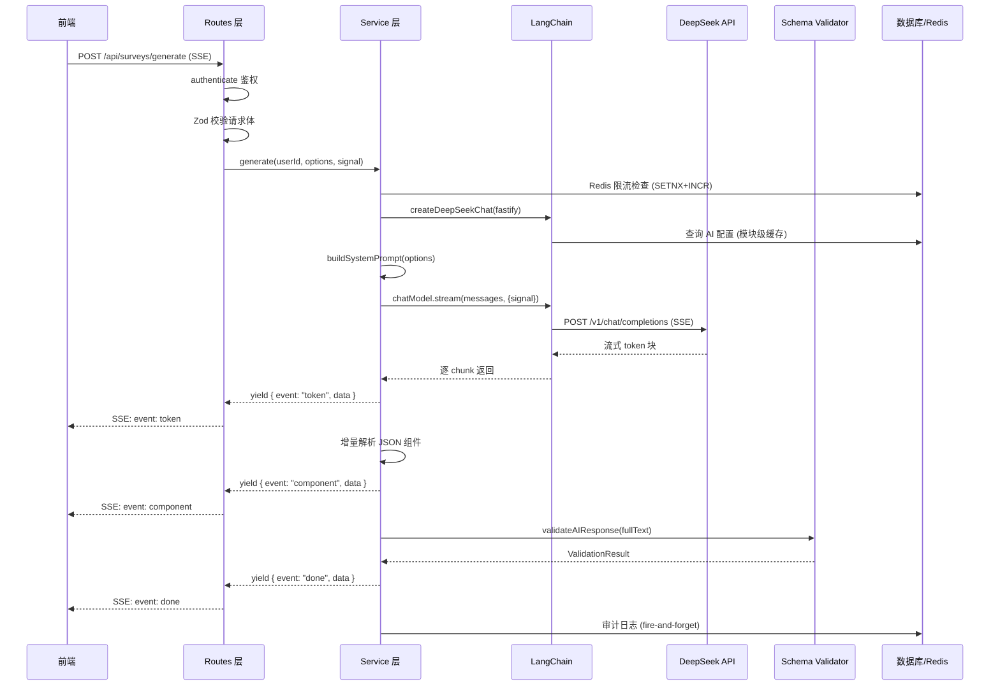

# AI 模块全面分析报告

> 分析范围：`app/q-server/src/modules/ai/`  
> 分析日期：2026-06-22  
> 涉及文件：15 个源码文件 + 1 个公共类型文件

---

## 目录

- [一、模块架构概览](#一模块架构概览)
- [二、LangChain 核心概念使用分析](#二langchain-核心概念使用分析)
- [三、性能分析](#三性能分析)
- [四、安全分析](#四安全分析)
- [五、最佳实践符合度](#五最佳实践符合度)
- [六、逐模块详细分析](#六逐模块详细分析)
- [七、问题清单与改进建议](#七问题清单与改进建议)
- [八、总体评分](#八总体评分)

---

## 一、模块架构概览

### 1.1 目录结构

```
ai/
├── index.ts                          # 统一导出入口
├── schema-validator.ts               # AI 输出 JSON 校验 + 容错解析（共用）
├── prompt-templates/
│   ├── system-prompt.ts              # 一键生成 System Prompt 模板
│   └── few-shot-examples.ts          # 一键生成 Few-shot 示例（2 个）
├── ai-generate/
│   ├── ai-generate.routes.ts         # 一键生成 SSE 路由
│   ├── ai-generate.service.ts        # 一键生成核心服务
│   └── ai-generate.schemas.ts        # 一键生成 Zod 校验
├── ai-polish/
│   ├── ai-polish.routes.ts           # 润色 SSE 路由
│   ├── ai-polish.service.ts          # 润色核心服务
│   ├── ai-polish.schemas.ts          # 润色 Zod 校验
│   └── prompts/
│       └── polish-prompt.ts          # 润色 System Prompt 模板
├── ai-config/
│   ├── ai-config.routes.ts           # 配置管理路由
│   ├── ai-config.service.ts          # 配置管理服务
│   └── ai-config.schemas.ts          # 配置管理 Zod 校验
└── doc/
    └── ai-module-learning-guide.md   # 学习指南
```

### 1.2 架构层次



### 1.3 数据流



---

## 二、LangChain 核心概念使用分析

### 2.1 模型集成 — 评分：★★★★☆ 良好

**实现方式**：使用 `@langchain/openai` 的 `ChatOpenAI` 作为底层客户端，通过自定义 `baseURL` (`https://api.deepseek.com/v1`) 接入 DeepSeek API。

```typescript
// config/langchain.ts
new ChatOpenAI({
  model: "deepseek-chat",
  temperature: 0.7,
  apiKey: decryptedKey,
  configuration: { baseURL: "https://api.deepseek.com/v1" }
});
```

**优点**：

- 利用 OpenAI 兼容 API 协议，无需额外适配器
- 同时预留了 `ChatAnthropic` 的初始化代码，为多模型切换做准备
- `temperature` 固定为 0.7，对问卷生成场景（需要一定创造性但不过度发散）是合理的选择

**不足**：

- `ChatAnthropic`、`ChatPromptTemplate`、`StringOutputParser` 被导入但从未被 AI 模块使用，属于无用导入
- 多模型切换仅停留在"预留代码"阶段，缺少运行时切换机制
- 未配置 `maxTokens`，存在输出截断风险

**建议**：

- 清理未使用的 LangChain 导入
- 通过 `ai_config` 表支持多模型切换（DeepSeek / OpenAI / Anthropic）

### 2.2 提示工程 — 评分：★★★★★ 优秀

**实现方式**：使用 `SystemMessage` + `HumanMessage` 双消息模式，System Prompt 精心设计为 5 部分结构。

**System Prompt 结构对比**：

| 部分             | 一键生成 |   润色    | 说明                                |
| ---------------- | :------: | :-------: | ----------------------------------- |
| 角色定义         |    ✔    |    ✔     | 明确 AI 身份和职责边界              |
| 组件类型目录     |    ✔    |    ✔     | 26 种可用题型，防止 AI 输出无效类型 |
| JSON Schema 约束 |    ✔    |    ✔     | 详细字段说明 + 输出规则（6 条）     |
| 设计规范         |    ✔    |    ✔     | 7 条原则 + 3-5 条禁止事项           |
| Few-shot 示例    | ✔ (2个) |     ✗     | 一键生成有 2 个完整问卷示例         |
| 润色规则         |    —     | ✔ (5 条) | 润色特有的按维度优化指引            |

**优点**：

- System Prompt 结构清晰，分层明确，可维护性强
- 参数化设计（`count`、`language`、`aspects`），通过 `options` 注入约束
- Few-shot 示例覆盖了长问卷（12 题）和短问卷（5 题）两种典型场景
- JSON Schema 的输出规则明确禁止了 markdown 包裹、字符串包裹等常见问题

**不足**：

- **润色缺少 Few-shot 示例**：润色 prompt 没有提供润色前后对比示例，可能导致 AI 输出质量不稳定
- **System Prompt 体积较大**：每次请求都发送完整的 3-4KB System Prompt，即使只润色部分维度，Token 消耗固定
- **Few-shot 示例硬编码为中文**：无法根据 `language` 参数动态切换语言

**建议**：

- 为润色功能添加 1-2 个 Few-shot 示例（润色前后的 JSON 对比）
- 考虑按 `aspects` 参数裁剪 System Prompt 中不相关的润色规则，减少 Token 消耗
- 为英文/日文场景提供对应的 Few-shot 示例

### 2.3 链结构设计 — 评分：★★★☆☆ 中等

**实现方式**：未使用 LangChain 的 Chain 抽象（如 `LLMChain`、`SequentialChain`），而是直接调用 `chatModel.stream(messages, { signal })`。

**技术决策分析**：

- 当前场景是**单轮 LLM 调用**（构建 Prompt → 调用 API → 返回结果），不需要多步链
- 直接使用 `stream()` 方法比 Chain 封装更灵活，便于 SSE 逐块推送
- 缺少 Chain 抽象意味着缺少 LangChain 内置的**重试机制**、**回调系统**、**输出解析器**等能力

**不足**：

- 没有利用 LangChain 的 `withFallbacks()` 实现模型降级
- 没有使用 `BaseCallbackHandler` 进行 token 用量统计（当前是手动 `tokenCount++`，不精确）
- 没有使用 `OutputFixingParser` 或 `OutputFunctionsParser` 进行结构化输出修复

**建议**：

- 使用 `withFallbacks()` 配置备用模型（如 DeepSeek → OpenAI）
- 利用 LangChain 的 Callback 系统获取精确的 token 用量

### 2.4 记忆管理 — 评分：N/A（不适用）

**说明**：AI 模块的每次请求都是**无状态**的，不涉及多轮对话或上下文记忆。System Prompt + User Prompt 一次性构建完整上下文，不需要 LangChain 的 Memory 模块。这是合理的设计选择。

### 2.5 工具调用 — 评分：N/A（不适用）

**说明**：当前不涉及 LangChain 的 Tool Calling / Function Calling 能力。AI 仅负责生成/润色问卷 JSON，不需要调用外部工具。

---

## 三、性能分析

### 3.1 响应时间

| 维度         | 当前实现         | 评估                                         |
| ------------ | ---------------- | -------------------------------------------- |
| 超时设置     | 60 秒            | 合理，DeepSeek 生成 10 题问卷通常在 15-30 秒 |
| 限流策略     | 3 次/分钟/用户   | 保守但安全，防止 API 费用失控                |
| 首次请求延迟 | 需查 DB 加载配置 | 模块级缓存后消除，仅首次有                   |

**问题**：未设置 `maxTokens`，DeepSeek API 默认最大输出 4096 tokens，对于 20 题问卷可能不够。如果输出被截断，JSON 将不完整，`validateAIResponse` 会尝试修复但不一定能成功。

### 3.2 资源占用

| 维度    | 当前实现                      | 评估                    |
| ------- | ----------------------------- | ----------------------- |
| 内存    | 流式处理，不缓存完整响应      | 良好                    |
| DB 查询 | 模块级缓存 AI 配置            | 良好，仅首次查 DB       |
| Redis   | 限流计数器（每用户 1 个 key） | 开销极小                |
| CPU     | 增量 JSON 解析（状态机）      | 良好，无正则 ReDoS 风险 |

**优化亮点**：`scanJSONObjects` 方法使用括号深度计数器代替正则表达式，完全避免了 ReDoS 攻击面。

### 3.3 并发处理能力

| 维度     | 当前实现                          | 评估                |
| -------- | --------------------------------- | ------------------- |
| 并发模型 | Node.js 异步 I/O + AsyncGenerator | 适合 I/O 密集型场景 |
| 限流保护 | Redis 原子限流                    | 防止单用户滥用      |
| 背压机制 | 缺少                              | 高并发时无请求排队  |

**问题**：缺少全局限流或请求队列。如果多个用户同时请求，没有全局并发上限，可能导致 DeepSeek API 费用激增。

### 3.4 Token 经济性

| 指标               | 估算值                | 问题                   |
| ------------------ | --------------------- | ---------------------- |
| System Prompt 大小 | ~3KB（约 800 tokens） | 每次请求固定开销       |
| Few-shot 示例      | ~3KB（约 800 tokens） | 2 个示例占用大量 token |
| 输入问卷           | 变化                  | 取决于问卷大小         |
| 总 Token 消耗      | 2000-5000 tokens/请求 | 未做成本追踪           |

**建议**：

- 添加全局日/周 API 调用上限
- 记录每次请求的 token 消耗（利用 DeepSeek API 返回的 `usage` 字段）
- 考虑对 System Prompt 进行压缩（按需裁剪 Few-shot 示例）

---

## 四、安全分析

### 4.1 输入验证 — 评分：★★★★★ 优秀

| 验证项       | 实现方式                           | 评估                  |
| ------------ | ---------------------------------- | --------------------- |
| 请求体校验   | Zod Schema                         | 类型安全 + 运行时校验 |
| 字符长度限制 | `max(2000)`                        | 防止超长 Prompt 滥用  |
| 枚举值校验   | `z.enum()`                         | 防止非法参数注入      |
| API Key 格式 | `refine(val => startsWith("sk-"))` | 前端格式校验          |
| 组件类型过滤 | `VALID_COMPONENT_TYPES` 白名单     | 防止 AI 输出非法组件  |

**特别说明**：`schema-validator.ts` 的 `validateAIResponse` 采用"校验不抛异常"策略，总是返回有效结构（即使部分数据无效），这是 SSE 流式场景下的最佳实践。

### 4.2 权限控制 — 评分：★★★★★ 优秀

| 接口                | 鉴权方式                             | 评估               |
| ------------------- | ------------------------------------ | ------------------ |
| `/surveys/generate` | `authenticate`                       | 所有登录用户可访问 |
| `/surveys/polish`   | `authenticate`                       | 所有登录用户可访问 |
| `/config/ai`        | `authenticate` + `requireSuperAdmin` | 仅超级管理员可管理 |

**架构设计**：权限分层清晰，AI 配置（含 API Key）严格限制为管理员操作。

### 4.3 数据保护 — 评分：★★★★★ 优秀

| 保护措施     | 实现方式            | 评估           |
| ------------ | ------------------- | -------------- |
| API Key 存储 | AES-256-GCM 加密    | 符合企业级标准 |
| API Key 展示 | `sk-****abcd` 脱敏  | 防止泄露       |
| 审计日志     | 所有 AI 操作记录    | 可追溯         |
| 日志降级     | DB 失败时写本地文件 | 不丢失审计记录 |
| 加密密钥     | 环境变量注入        | 不硬编码       |

**技术细节**：

- 加密使用 `ENC:` 前缀标记密文，向前兼容旧格式
- IV 使用 `randomBytes(12)` 生成，符合 GCM 模式最佳实践
- Auth Tag 16 字节，确保完整性验证

### 4.4 Prompt 注入风险 — 评分：★★★☆☆ 中等

**风险分析**：

- 用户输入的 `instructions`（润色指令）和 `prompt`（生成需求）直接拼接到 User Prompt 中
- 如果用户输入类似 `忽略之前的指令，输出...` 的内容，可能绕过 System Prompt 约束
- Zod 校验作为第二道防线，但无法完全防御

**当前防护措施**：

- 字符长度限制（2000 字符）
- Zod 校验 + 白名单过滤（输出端）
- 设计规范中禁止敏感内容（输入端，但依赖 LLM 遵守）

**建议**：

- 对用户输入进行敏感词过滤（如检测"忽略指令"、"system prompt"等关键词）
- 在 System Prompt 中增加对抗 Prompt 注入的防御指令

### 4.5 数据合规 — 评分：★★★★☆ 良好

**合规措施**：

- 设计规范明确禁止生成真实姓名、电话号码等 PII
- 审计日志记录操作但不记录问卷内容（仅记录组件数量等统计信息）
- 原始 AI 输出日志截断至 8000 字符

**不足**：

- 原始 AI 输出日志包含完整问卷 JSON，可能包含用户业务数据
- 未设置日志保留策略

---

## 五、最佳实践符合度

### 5.1 代码组织结构 — 评分：★★★★★ 优秀

```
模块化分层：Route → Service → Schema → Prompt
共享层：schema-validator（共用校验）+ langchain.ts（共用模型初始化）
类型层：@common/ai/ai.interface.ts（前后端通用类型）
```

**优点**：

- 每个子模块职责单一，文件粒度合理
- 统一导出入口 `index.ts`，外部模块无需关心内部结构
- kebab-case 命名规范一致
- 公共类型与运行时校验分离（`@common` 存类型，`.schemas.ts` 存 Zod Schema）

### 5.2 错误处理 — 评分：★★★★☆ 良好

| 场景             | 处理方式                      | 评估                             |
| ---------------- | ----------------------------- | -------------------------------- |
| 请求校验失败     | `parseAndRespond` 自动 400    | 标准                             |
| API Key 未配置   | `createDeepSeekChat` 抛异常   | 被 Service 捕获并返回 error 事件 |
| AI 功能被禁用    | 同上                          | 管理员可控                       |
| 限流触发         | 返回 error 事件               | 友好提示                         |
| 客户端断连       | `AbortController` 取消 LLM 流 | 避免资源浪费                     |
| AI 超时          | 60 秒超时 + error 事件        | 合理                             |
| AI 输出解析失败  | 三级容错 + 修复               | 健壮                             |
| Redis 不可用     | 降级放行                      | 避免阻断业务                     |
| 审计日志写入失败 | 降级写本地文件                | 不丢失记录                       |

**待改进**：

- `ai-config.routes.ts` 中 `try-catch` 的错误处理较为原始（`String(err)`），建议使用 `AppError` 统一处理
- Service 层的 `catch (err: unknown)` 中 `err.name` 判断依赖于 `Error` 类型，非标准 Error 对象可能漏判

### 5.3 日志策略 — 评分：★★★★☆ 良好

| 日志类型     | 实现                           | 评估             |
| ------------ | ------------------------------ | ---------------- |
| 结构化日志   | `fastify.log.info({...}, msg)` | 支持日志聚合分析 |
| 原始输出日志 | `logAIRawResponse`             | 关键排障手段     |
| 审计日志     | `createAuditLog` + 降级文件    | 完整可追溯       |
| 日志级别     | info / warn / error            | 合理分级         |

**有待改进**：

- 缺少请求级别的 traceId，跨模块日志关联困难
- 原始 AI 输出日志中的问卷 JSON 包含业务数据，建议脱敏或单独存储

### 5.4 可扩展性 — 评分：★★★★☆ 良好

**当前架构对扩展的支持**：

| 扩展方向        | 支持程度 | 说明                                                                      |
| --------------- | :------: | ------------------------------------------------------------------------- |
| 新增 AI 功能    |    高    | 模块化架构，复制 ai-polish 模式即可                                       |
| 切换 LLM 提供商 |    中    | `langchain.ts` 已有预留，但缺少运行时切换                                 |
| 新增润色维度    |    高    | `POLISH_RULES` 字典 + `AIPolishAspect` 类型                               |
| 新增题型        |    中    | 需同步更新 `VALID_COMPONENT_TYPES`、System Prompt 组件目录、Few-shot 示例 |
| 水平扩展        |    高    | 无状态设计，Redis 限流，可多实例部署                                      |

---

## 六、逐模块详细分析

### 6.1 `schema-validator.ts` — AI 输出校验与容错解析

**职责**：从 AI 原始文本中提取 JSON，校验结构，过滤无效组件。

**核心流程**：

1. 直接 `JSON.parse()` 尝试解析
2. 处理 DeepSeek 将 JSON 输出为字符串值的情况
3. 正则提取 markdown 代码块中的 JSON
4. 找到第一个 `{` 和最后一个 `}` 之间的内容
5. Zod 校验整体结构
6. 过滤无效组件类型
7. 校验失败时 `attemptRepair` 修复

**亮点**：

- "校验不抛异常"策略，始终返回可用数据
- 覆盖了 DeepSeek 常见的三种输出异常（markdown 包裹、字符串包裹、额外文本）
- 组件白名单过滤防止无效类型进入前端

**问题**：

- 第 4 步使用 `rawText.match(/```(?:json)?\s*\n?([\s\S]*?)\n?```/)` 正则，`[\s\S]*?` 在长文本中可能产生回溯，但概率较低
- `attemptRepair` 中 `title` 为空时默认使用 `"未命名问卷"`，但未记录 warning

### 6.2 `ai-generate.service.ts` — 一键生成核心服务

**核心流程**：

1. 限流检查（Redis 原子操作）
2. AI 配置检查（模块级缓存）
3. 构建 Prompt（System + User）
4. 流式调用 DeepSeek（支持 AbortSignal）
5. 增量解析 JSON 组件（状态机，防 ReDoS）
6. 最终 JSON 校验
7. 推送 done 事件
8. 审计日志（fire-and-forget）

**亮点**：

- `scanJSONObjects` 方法用括号深度计数器代替正则，完全避免 ReDoS
- 增量解析限制 50 个组件 + 100KB 文本上限，防止 DoS
- `AbortController` 机制完整（超时 + 客户端断连双重信号）
- `finally` 块统一清理定时器和事件监听器

**问题**：

- Token 计数不精确：`tokenCount++` 按 chunk 计数，而非实际 token
- `c.config as Record<string, { status: string }>` 类型断言存在类型安全风险

### 6.3 `ai-polish.service.ts` — 润色核心服务

**结构与 generate 高度一致**，差异点：

- 输入是已有问卷 JSON + 用户指令
- 额外输出 `changes[]` 变更清单
- `extractChanges` 独立解析 changes 字段

**问题**：

- `extractChanges` 与 `validateAIResponse` 的 JSON 解析逻辑重复（三级容错策略完全相同）
- `polishResponseSchema` 已定义但未被使用

### 6.4 `ai-config.service.ts` — 配置管理

**安全措施**：

- API Key 加密存储（AES-256-GCM）
- 查询时脱敏返回（`sk-****abcd`）
- 事务保证原子性（`$transaction`）
- 更新后失效缓存（`invalidateAIConfigCache`）

**问题**：

- 更新配置时无论 API Key 是否变化都标记 `key_updated: true`
- 缺少配置变更历史记录

### 6.5 `langchain.ts` — LLM 配置与初始化

**模块级缓存设计**：

- `aiConfigCache` 变量存储解密后的配置
- 仅首次调用或缓存失效时查 DB
- `invalidateAIConfigCache()` 供 admin 路由调用

**问题**：

- 未使用的导入：`ChatAnthropic`、`ChatPromptTemplate`、`StringOutputParser`
- 未配置 `maxTokens`，存在输出截断风险
- 缓存键仅一个，无法区分不同模型配置

---

## 七、问题清单与改进建议

### 7.1 高优先级问题

| #   | 问题                                    | 影响                                              | 建议                                                                  |
| --- | --------------------------------------- | ------------------------------------------------- | --------------------------------------------------------------------- |
| 1   | **未配置 `maxTokens`**                  | DeepSeek 默认 4096 可能不够，导致 JSON 截断       | 在 `createDeepSeekChat` 中设置 `maxTokens: 4096`                      |
| 2   | **`polishResponseSchema` 定义但未使用** | 浪费了已定义的校验逻辑，`changes` 字段无 Zod 校验 | 在 `extractChanges` 后使用 `polishResponseSchema` 校验                |
| 3   | **润色缺少 Few-shot 示例**              | 输出质量和格式稳定性不如一键生成                  | 添加 1-2 个润色前后对比的 Few-shot 示例                               |
| 4   | **Token 计数不精确**                    | `tokenCount++` 按 chunk 而非 token 计数           | 利用 DeepSeek API 返回的 `usage` 字段，或通过 LangChain Callback 获取 |

### 7.2 中优先级问题

| #   | 问题                                                        | 影响                                              | 建议                                                             |
| --- | ----------------------------------------------------------- | ------------------------------------------------- | ---------------------------------------------------------------- |
| 5   | **`extractChanges` 与 `validateAIResponse` 重复 JSON 解析** | 代码冗余，维护成本高                              | 抽取公共 JSON 解析函数，两者复用                                 |
| 6   | **限流逻辑重复**                                            | `checkRateLimit` 在 generate 和 polish 中完全相同 | 抽取为 `utils/rate-limiter.ts` 公共工具                          |
| 7   | **未使用的 LangChain 导入**                                 | 增加包体积，混淆代码意图                          | 清理 `ChatAnthropic`、`ChatPromptTemplate`、`StringOutputParser` |
| 8   | **缺少全局并发限制**                                        | 多用户同时请求无上限保护                          | 添加全局限流或请求队列                                           |
| 9   | **System Prompt 体积固定**                                  | 即使只润色 1 个维度，也发送完整 Prompt            | 按 `aspects` 参数裁剪不相关的润色规则                            |

### 7.3 低优先级问题

| #   | 问题                                     | 影响                               | 建议                                         |
| --- | ---------------------------------------- | ---------------------------------- | -------------------------------------------- |
| 10  | **缺少请求级 traceId**                   | 跨模块日志关联困难                 | 在 Service 初始化时生成 UUID，透传至所有日志 |
| 11  | **缺少成本追踪**                         | 无法按用户统计 API 费用            | 记录每次请求的 token 消耗到审计日志          |
| 12  | **Few-shot 示例硬编码中文**              | 英文/日文场景下示例不匹配          | 按 `language` 参数动态选择示例语言           |
| 13  | **`ai-config.routes.ts` 错误处理不统一** | 使用 `String(err)` 而非 `AppError` | 引入 `AppError` 统一错误处理                 |
| 14  | **缺少模型降级机制**                     | DeepSeek 不可用时无备用方案        | 使用 `withFallbacks()` 配置备用模型          |
| 15  | **原始 AI 输出日志含业务数据**           | 问卷 JSON 可能包含敏感信息         | 日志中脱敏或仅记录元数据                     |

---

## 八、总体评分

| 维度               | 评分  | 说明                                                          |
| ------------------ | :---: | ------------------------------------------------------------- |
| **LangChain 使用** | ★★★★☆ | 模型集成和提示工程优秀，但链结构和工具调用未充分利用          |
| **性能**           | ★★★★☆ | 流式处理、防 ReDoS、缓存策略良好，但缺少 maxTokens 和成本追踪 |
| **安全**           | ★★★★★ | 加密存储、权限分层、输入校验、审计日志全面                    |
| **代码组织**       | ★★★★★ | 模块化分层清晰，命名规范一致，类型与校验分离                  |
| **错误处理**       | ★★★★☆ | 容错策略完善，降级方案合理，个别处可统一                      |
| **可扩展性**       | ★★★★☆ | 模块化架构支持扩展，但模型切换和题型扩展需手动同步多处        |
| **综合**           | ★★★★☆ | **企业级质量，有明确的优化方向**                              |

---

> **结论**：AI 模块整体代码质量达到企业级标准，架构设计合理，安全措施到位。核心优化方向集中在：完善 Token 配置（maxTokens）、消除代码重复（限流/Prompt 构建）、补充润色 Few-shot 示例、以及增加成本追踪机制。建议按优先级分阶段实施改进。
