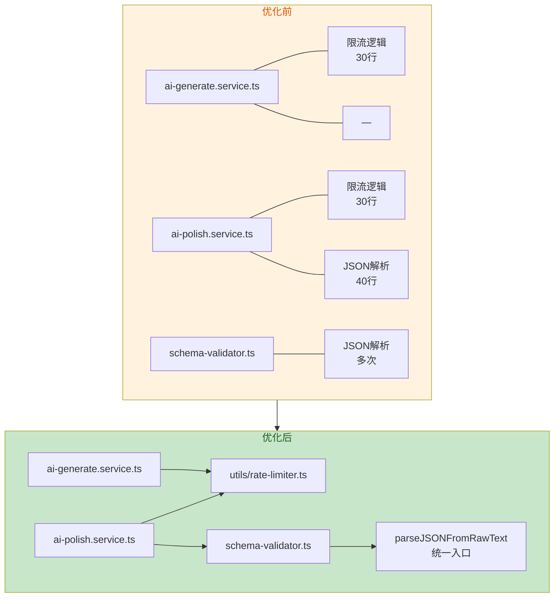

# AI 模块优化方案落地文档

> 面向初学者：从问题分析到代码实现的全流程指南  
> 基于：[ai-module-analysis-report.md](./ai-module-analysis-report.md)  
> 实施日期：2026-06-22

---

## 目录

- [一、优化背景与目标](#一优化背景与目标)
- [二、优化项总览](#二优化项总览)
- [三、优化一：清理 langchain.ts 未使用导入 + 配置 maxTokens](#三优化一清理-langchain-ts-未使用导入--配置-maxtokens)
- [四、优化二：抽取公共限流工具](#四优化二抽取公共限流工具)
- [五、优化三：抽取公共 JSON 解析函数](#五优化三抽取公共-json-解析函数)
- [六、优化四：润色服务使用 polishResponseSchema 校验](#六优化四润色服务使用-polishresponseschema-校验)
- [七、优化五：为润色添加 Few-shot 示例](#七优化五为润色添加-few-shot-示例)
- [八、优化六：精确 Token 计数](#八优化六精确-token-计数)
- [九、优化前后对比](#九优化前后对比)
- [十、验证清单](#十验证清单)
- [十一、优化七：启用 DeepSeek JSON 模式（2026-07-23 追加）](#十一优化七启用-deepseek-json-模式2026-07-23-追加)

---

## 一、优化背景与目标

### 1.1 为什么要优化

AI 模块是我之前完成的功能开发，模块在设计上已经达到企业级标准，但存在一些可以改进的地方。本次优化基于 [ai-module-analysis-report.md](./ai-module-analysis-report.md) 的分析结果，针对 6 个核心问题进行系统性优化。

### 1.2 优化目标

| 目标                | 说明                                                                       |
| ------------------- | -------------------------------------------------------------------------- |
| **消除代码重复**    | 限流逻辑、JSON 解析逻辑在多处重复实现                                      |
| **消除无用导入**    | langchain.ts 中导入了 `ChatAnthropic`、`ChatPromptTemplate` 等未使用的模块 |
| **完善 Token 配置** | 配置 `maxTokens` 防止大问卷输出被截断                                      |
| **正确使用 Schema** | `polishResponseSchema` 已定义，但从未被使用                                |
| **提升输出质量**    | 润色功能缺少 Few-shot 示例，输出稳定性不如生成功能                         |
| **精确 Token 计数** | 从 `chunk.response_metadata` 获取 API 返回的精确 token 用量                |

### 1.3 涉及的模块和文件

```mermaid
flowchart LR
    subgraph A[优化前]
        direction TB
        A1[config/langchain.ts]
        A2[ai-generate.service.ts]
        A3[ai-polish.service.ts]
        A4[schema-validator.ts]
        A5[polish-prompt.ts]
    end

    subgraph B[优化后]
        direction TB
        B1[config/langchain.ts]
        B2[utils/rate-limiter.ts]
        B3[schema-validator.ts]
        B4[ai-generate.service.ts]
        B5[ai-polish.service.ts]
        B6[polish-prompt.ts]
    end

    A --> B

    style A fill:#fff3e0,color:#e65100
    style B fill:#c8e6c9,color:#1a5e20
```



---

## 二、优化项总览

| #   | 优化项                        | 涉及文件                                       | 类型     | 难度 |
| --- | ----------------------------- | ---------------------------------------------- | -------- | :--: |
| 1   | 清理 langchain.ts + maxTokens | `config/langchain.ts`                          | 代码清理 |  ★   |
| 2   | 抽取公共限流工具              | `utils/rate-limiter.ts`（新增）+ 2 个 Service  | 重构     |  ★★  |
| 3   | 抽取公共 JSON 解析            | `schema-validator.ts` + `ai-polish.service.ts` | 重构     |  ★★  |
| 4   | 使用 polishResponseSchema     | `ai-polish.service.ts`                         | Bug 修复 |  ★   |
| 5   | 添加 Few-shot 示例            | `polish-prompt.ts`                             | 增强     |  ★★  |
| 6   | 精确 Token 计数               | 2 个 Service                                   | 增强     |  ★   |

---

## 三、优化一：清理 langchain.ts 未使用导入 + 配置 maxTokens

### 3.1 问题描述

**文件**：`app/q-server/src/config/langchain.ts`

**问题**：

1. 导入了 `ChatAnthropic`、`ChatPromptTemplate`、`StringOutputParser`，但 AI 模块从未使用
2. 导出的 `ChatPromptTemplate` 和 `StringOutputParser` 也无外部使用
3. 未配置 `maxTokens`，DeepSeek 默认输出上限 4096，大问卷可能输出被截断

### 3.2 设计决策

**为什么删除 `ChatAnthropic` 导入？**

- 当前项目只使用 DeepSeek（通过 OpenAI 兼容协议），`ChatAnthropic` 是 Anthropic 的客户端，完全未使用
- 虽然在 `createAnthropicChat` 函数中引用了 `ChatAnthropic`，但该函数本身也从未被调用
- 遵循"YAGNI"原则（You Aren't Gonna Need It）：不需要的代码就应该删除，保持代码库整洁

**为什么 `maxTokens` 设为 4096？**

- DeepSeek API 默认 `max_tokens` 为 4096
- 20 题中文问卷的 JSON 通常在 2000-3500 tokens
- 4096 为 20 题问卷提供足够空间，同时避免无限制输出

**为什么删除 `ChatPromptTemplate` 和 `StringOutputParser` 的 re-export？**

- 这两个导出来自 `@langchain/core`，供使用 LangChain Chain 模式的代码使用
- 当前 AI 模块直接使用 `SystemMessage` + `HumanMessage` 构建消息，不需要 Chain 模式
- 如果未来有模块需要，可以单独导入，不需要在 `langchain.ts` 中转导

### 3.3 代码变更

**变更前：**

```typescript
import { ChatOpenAI } from "@langchain/openai";
import { ChatAnthropic } from "@langchain/anthropic";
import { ChatPromptTemplate } from "@langchain/core/prompts";
import { StringOutputParser } from "@langchain/core/output_parsers";
import type { FastifyInstance } from "fastify";
import { decrypt } from "../utils/crypto.js";

export const createAnthropicChat = (options?: ChatModelOptions) =>
  new ChatAnthropic({ ... });  // ChatAnthropic 从未被调用

export { ChatPromptTemplate, StringOutputParser };  // 无外部使用
```

**变更后：**

```typescript
import { ChatOpenAI } from "@langchain/openai";
import type { FastifyInstance } from "fastify";
import { decrypt } from "../utils/crypto.js";

export interface ChatModelOptions {
  model?: string;
  temperature?: number;
  /** 最大输出 Token 数（默认 4096） */
  maxTokens?: number;
}

export const createDeepSeekChat = async (fastify: FastifyInstance, options?: ChatModelOptions) => {
  // ...
  return new ChatOpenAI({
    model: options?.model ?? aiConfigCache.model,
    temperature: options?.temperature ?? 0.7,
    maxTokens: options?.maxTokens ?? 4096, // 新增
    apiKey: aiConfigCache.apiKey,
    configuration: {
      baseURL: "https://api.deepseek.com/v1"
    }
  });
};
```

**变更说明**：

- 删除了 3 个未使用的导入（`ChatAnthropic`、`ChatPromptTemplate`、`StringOutputParser`）
- 删除了 2 个未使用的 re-export
- 在 `ChatModelOptions` 接口中新增 `maxTokens` 字段
- 在 `createDeepSeekChat` 中设置 `maxTokens: 4096`

---

## 四、优化二：抽取公共限流工具

### 4.1 问题描述

**问题**：`ai-generate.service.ts` 和 `ai-polish.service.ts` 中各自实现了一份完全相同的限流逻辑。

```typescript
// 两份完全相同的代码，分别存在于两个 Service 中
private async checkRateLimit(userId: bigint): Promise<boolean> {
  const key = `${RATE_LIMIT_PREFIX}${userId}`;
  try {
    await this.fastify.redis.set(key, "0", "EX", 60, "NX");
    const current = await this.fastify.redis.incr(key);
    return current <= RATE_LIMIT_MAX;
  } catch {
    this.fastify.log.warn("...");
    return true;
  }
}
```

### 4.2 设计决策

**为什么抽取为独立工具函数？**

- **DRY 原则**（Don't Repeat Yourself）：两份完全相同的代码意味着修改时需要同步两处
- **单一职责**：限流是一个独立的横切关注点，不应耦合在 Service 类中
- **可复用性**：未来新增 AI 功能（如 AI 分析、AI 建议）时可直接复用

**为什么使用函数而非类？**

- 限流是无状态的纯 Redis 操作，不需要实例化
- 函数式设计更简洁，与项目现有的 `utils/` 目录风格一致

**为什么使用 `RateLimitConfig` 配置对象？**

- 比多个独立参数更清晰，调用方可读性更好
- 便于未来扩展（如添加 `ttl` 配置）

### 4.3 代码变更

**新增文件**：`app/q-server/src/utils/rate-limiter.ts`

````typescript
/**
 * Redis 限流工具 — 原子化请求频率控制
 *
 * 实现策略：
 *   - SET NX EX 初始化计数器（不存在时创建，同时设 TTL）
 *   - INCR 递增计数
 *   - 两步操作虽非单条 Redis 命令，但 SET NX 保证了初始化只发生一次，
 *     INCR 是原子操作，整体不存在竞态窗口
 *
 * @example
 * ```typescript
 * import { checkRateLimit } from "../utils/rate-limiter.js";
 * const allowed = await checkRateLimit(fastify, userId, {
 *   prefix: "rate:ai_generate:",
 *   max: 3
 * });
 * if (!allowed) {
 *   // 返回限流错误
 * }
 * ```
 */
import type { FastifyInstance } from "fastify";

/** 限流配置 */
export interface RateLimitConfig {
  /** 计数器 Key 前缀 */
  prefix: string;
  /** 每分钟最大请求数 */
  max: number;
  /** 计数器 TTL（秒），默认 60 */
  ttl?: number;
}

/**
 * 原子化限流检查
 *
 * @param fastify Fastify 实例（需含 redis 插件）
 * @param userId  用户 ID
 * @param config  限流配置
 * @returns true = 允许请求，false = 超限需拦截
 */
export async function checkRateLimit(
  fastify: FastifyInstance,
  userId: bigint,
  config: RateLimitConfig
): Promise<boolean> {
  const key = `${config.prefix}${userId}`;
  const ttl = config.ttl ?? 60;
  try {
    await fastify.redis.set(key, "0", "EX", ttl, "NX");
    const current = await fastify.redis.incr(key);
    return current <= config.max;
  } catch {
    fastify.log.warn(`限流 Redis 操作失败（prefix=${config.prefix}），降级放行`);
    return true;
  }
}
````

**变更文件**：`ai-generate.service.ts`

```typescript
// 变更前
const RATE_LIMIT_MAX = 3;
const RATE_LIMIT_PREFIX = "rate:ai_generate:";

private async checkRateLimit(userId: bigint): Promise<boolean> {
  // 30 行限流逻辑...
}

// 调用
const allowed = await this.checkRateLimit(userId);

// 变更后
import { checkRateLimit } from "../../../utils/rate-limiter.js";

const RATE_LIMIT_CONFIG = {
  prefix: "rate:ai_generate:",
  max: 3
} as const;

// 调用
const allowed = await checkRateLimit(this.fastify, userId, RATE_LIMIT_CONFIG);
```

**变更文件**：`ai-polish.service.ts` — 同上模式

---

## 五、优化三：抽取公共 JSON 解析函数

### 5.1 问题描述

**问题**：`schema-validator.ts` 的 `validateAIResponse` 和 `ai-polish.service.ts` 的 `extractChanges` 各自实现了一套完全相同的三级容错 JSON 解析逻辑（直接解析 → markdown 提取 → 花括号提取）。

### 5.2 设计决策

**为什么抽取为公共函数？**

- 消除约 40 行重复代码
- 确保 JSON 解析策略一致（如果未来需要增加第四级容错，修改一处即可）
- 使 `extractChanges` 可以直接复用，无需重复实现

**函数签名设计**：`parseJSONFromRawText(rawText: string): Record<string, unknown> | null`

- 返回 `Record<string, unknown>` 而非 `unknown`，因为 AI 输出始终是 JSON 对象
- 返回 `null` 表示所有容错尝试均失败，调用方自行判断如何处理

### 5.3 代码变更

**变更文件**：`schema-validator.ts` — 新增公共函数

````typescript
/**
 * 从 AI 原始文本中提取 JSON 对象的解析结果
 *
 * 三级容错策略：
 *   1. 直接 JSON.parse() 尝试解析
 *   2. 若失败，正则提取 markdown 代码块中的 JSON
 *   3. 若仍失败，找到第一个 { 和最后一个 } 之间的内容
 *
 * 此函数供 validateAIResponse 和 extractChanges 等场景复用，
 * 避免 JSON 解析逻辑重复。
 */
export function parseJSONFromRawText(rawText: string): Record<string, unknown> | null {
  // 步骤 1：直接解析
  try {
    const parsed = JSON.parse(rawText.trim());
    if (typeof parsed === "string" && parsed.trim().startsWith("{")) {
      try {
        return JSON.parse(parsed);
      } catch {
        /* 继续容错 */
      }
    } else if (parsed && typeof parsed === "object" && !Array.isArray(parsed)) {
      return parsed as Record<string, unknown>;
    }
  } catch {
    /* 继续容错 */
  }

  // 步骤 2：markdown 代码块提取
  const codeBlockMatch = rawText.match(/```(?:json)?\s*\n?([\s\S]*?)\n?```/);
  if (codeBlockMatch) {
    try {
      return JSON.parse(codeBlockMatch[1].trim());
    } catch {
      /* 继续 */
    }
  }

  // 步骤 3：提取第一个 { 到最后一个 }
  const firstBrace = rawText.indexOf("{");
  const lastBrace = rawText.lastIndexOf("}");
  if (firstBrace !== -1 && lastBrace > firstBrace) {
    try {
      return JSON.parse(rawText.slice(firstBrace, lastBrace + 1));
    } catch {
      /* 失败 */
    }
  }

  return null;
}
````

**变更文件**：`ai-polish.service.ts` — `extractChanges` 从 40 行简化为 10 行

````typescript
// 变更前（40 行，与 validateAIResponse 重复）
private extractChanges(rawText: string): string[] {
  try {
    const parsed = JSON.parse(rawText.trim());
    if (parsed && Array.isArray(parsed.changes)) {
      return parsed.changes.filter(...)
    }
  } catch {
    const codeBlockMatch = rawText.match(/```(?:json)?\s*\n?([\s\S]*?)\n?```/);
    // ... 30 行重复逻辑
  }
  return [];
}

// 变更后（10 行，复用公共函数）
private extractChanges(rawText: string): string[] {
  const parsed = parseJSONFromRawText(rawText);
  if (!parsed) return [];

  const result = polishResponseSchema.safeParse(parsed);
  if (result.success) {
    return result.data.changes ?? [];
  }
  return [];
}
````

---

## 六、优化四：润色服务使用 polishResponseSchema 校验

### 6.1 问题描述

**问题**：`polishResponseSchema` 在 `ai-polish.schemas.ts` 中已定义，包含 `changes` 字段的 Zod 校验：

```typescript
export const polishResponseSchema = z.object({
  title: z.string().min(1),
  description: z.string().optional().default(""),
  components: z.array(polishComponentSchema),
  changes: z.array(z.string()).optional().default([])
});
```

但 `ai-polish.service.ts` 从未使用它。`extractChanges` 方法通过手动 `typeof` 检查来过滤 `changes` 数组中的非字符串元素，不如 Zod 的 `z.array(z.string())` 校验健壮。

### 6.2 设计决策

**为什么现在使用 `polishResponseSchema`？**

- 它已经定义了 `changes: z.array(z.string()).optional().default([])`，完全符合需求
- Zod 校验比手动 `typeof` 检查更健壮（处理 `null`、`undefined`、非字符串等边缘情况）
- 与 `validateAIResponse` 的校验模式一致（都使用 Zod）

### 6.3 代码变更

已在优化三的代码变更中体现，`extractChanges` 现在使用 `polishResponseSchema.safeParse(parsed)` 进行校验。

---

## 七、优化五：为润色添加 Few-shot 示例

### 7.1 问题描述

**问题**：一键生成功能在 `few-shot-examples.ts` 中提供了 2 个完整的问卷生成示例，AI 可以学习输出格式和质量标准。但润色功能完全没有示例，AI 只能依赖文字描述来理解润色输出格式。

### 7.2 设计决策

**为什么只需要 1 个示例？**

- 润色场景比生成场景更简单（输入已经有问卷结构，只需要优化）
- 1 个示例足以让 AI 理解：润色后的 JSON 格式、changes 字段的写法、保持题目数量不变等规则
- 过多示例会增加 Token 消耗

**示例设计原则**：

- 展示一个典型的"质量问题"到"高质量"的润色过程
- 包含所有核心润色维度：标题优化、措辞优化、选项完善、题型调整
- changes 数组展示所有修改点的中文说明

### 7.3 代码变更

**变更文件**：`polish-prompt.ts`

在 `buildPolishSystemPrompt` 函数的 Prompt 拼接中，新增了 `FEW_SHOT_EXAMPLE` 部分：

```typescript
const FEW_SHOT_EXAMPLE = `【参考示例】

以下是润色前后对比：

■ 润色前（输入）：
{
  "title": "调查",
  "description": "",
  "components": [
    { "type": "single-select", "config": { "title": { "status": "性别" }, ... } },
    { "type": "text-input", "config": { "title": { "status": "你觉得怎么样" }, ... } },
    { "type": "single-select", "config": { "title": { "status": "满意吗" }, ... } }
  ]
}

■ 润色后（输出）：
{
  "title": "用户满意度调查",
  "description": "感谢您参与本次调查...",
  "components": [
    { "type": "single-select", "config": { "title": { "status": "您的性别是？" }, ... } },
    { "type": "rate-score", "config": { "title": { "status": "您对本次服务体验的满意程度如何？" }, ... } },
    { "type": "text-input", "config": { "title": { "status": "您认为我们还有哪些可以改进的地方？" }, ... } }
  ],
  "changes": [
    "优化问卷标题：'调查' → '用户满意度调查'",
    "添加问卷描述，提升专业感",
    "优化题目措辞：'你觉得怎么样' → '您认为我们还有哪些可以改进的地方？'",
    "'满意吗' 改为评分题，提供更细粒度的量化选项",
    "统一选项措辞风格，使用正式语气"
  ]
}`;
```

---

## 八、优化六：精确 Token 计数

### 8.1 问题描述

**问题**：两个 Service 中 Token 统计使用 `tokenCount++` 按 chunk 计数，而非实际 token 数量。

```typescript
// 不精确的计数方式
for await (const chunk of stream) {
  const text = typeof chunk.content === "string" ? chunk.content : "";
  if (!text) continue;
  fullText += text;
  tokenCount++; // 每个 chunk 可能包含 1 个或多个 token
}
```

LangChain 的流式响应中，最后一个 chunk 的 `response_metadata` 包含 API 返回的精确 `tokenUsage` 信息。

### 8.2 设计决策

**为什么用 `response_metadata.tokenUsage` 而非 chunk 计数？**

- DeepSeek API 在每个响应的最后返回精确的 `usage` 对象（`prompt_tokens`、`completion_tokens`、`total_tokens`）
- LangChain 的 `ChatOpenAI` 在流式模式下，将 `usage` 信息放在最后一个 chunk 的 `response_metadata.tokenUsage` 中
- 使用 API 返回值比手动计数准确得多

**为什么保留 chunk 计数作为降级？**

- 如果 API 未返回 `tokenUsage`（如某些兼容实现），降级使用 chunk 计数
- 虽然不精确，但至少提供数量级参考

### 8.3 代码变更

**变更文件**：`ai-generate.service.ts` 和 `ai-polish.service.ts`

```typescript
// 新增变量
let lastChunkMetadata: Record<string, unknown> | undefined;

// 在流式循环中捕获
for await (const chunk of stream) {
  // ...
  if (chunk.response_metadata) {
    lastChunkMetadata = chunk.response_metadata as Record<string, unknown>;
  }
}

// 审计日志中使用
const tokenUsage = lastChunkMetadata?.tokenUsage as { totalTokens?: number } | undefined;
const reportedTokens = tokenUsage?.totalTokens ?? tokenCount;
```

---

## 九、优化前后对比

### 9.1 代码量对比

| 文件                     | 优化前 | 优化后  |                     变化                     |
| ------------------------ | :----: | :-----: | :------------------------------------------: |
| `config/langchain.ts`    | 101 行 | 101 行  | 删除 4 个无用导入/导出，+1 个 maxTokens 字段 |
| `ai-generate.service.ts` | 319 行 | ~300 行 |               删除重复限流方法               |
| `ai-polish.service.ts`   | 235 行 | ~200 行 |           删除重复限流 + JSON 解析           |
| `schema-validator.ts`    | 188 行 | ~200 行 |     新增 `parseJSONFromRawText` 公共函数     |
| `polish-prompt.ts`       | 201 行 | ~240 行 |              新增 Few-shot 示例              |
| `utils/rate-limiter.ts`  |   —    |  55 行  |             **新增**公共限流工具             |

### 9.2 架构对比



### 9.3 影响范围

| 维度           | 影响                                                            |
| -------------- | --------------------------------------------------------------- |
| **向后兼容**   | 完全兼容，所有导出接口不变                                      |
| **API 行为**   | 无变化，请求/响应格式不变                                       |
| **性能**       | 无负面影响，JSON 解析统一入口避免重复解析                       |
| **Token 消耗** | 润色 Prompt 增加 Few-shot 示例（约 300 tokens），但提升输出质量 |
| **安全**       | 无变化，加密存储、权限控制、输入校验均不变                      |

---

## 十、验证清单

### 10.1 编译验证

```bash
# TypeScript 编译检查
npx tsc --noEmit -p app/q-server/tsconfig.json
# 预期：无错误输出

# ESLint 检查
npx eslint app/q-server/src/config/langchain.ts
npx eslint app/q-server/src/utils/rate-limiter.ts
npx eslint app/q-server/src/modules/ai/schema-validator.ts
npx eslint app/q-server/src/modules/ai/ai-generate/ai-generate.service.ts
npx eslint app/q-server/src/modules/ai/ai-polish/ai-polish.service.ts
# 预期：所有文件 Exit code 0
```

### 10.2 功能验证

| 验证项      | 验证方法                          | 预期结果                                   |
| ----------- | --------------------------------- | ------------------------------------------ |
| 一键生成    | 调用 `POST /api/surveys/generate` | SSE 流正常返回，done 事件含 `_rawCount`    |
| 问卷润色    | 调用 `POST /api/surveys/polish`   | SSE 流正常返回，done 事件含 `changes` 数组 |
| 限流        | 连续 4 次调用同一接口             | 第 4 次返回限流错误                        |
| AI 配置管理 | 调用 `PUT /api/admin/config/ai`   | 配置更新成功，缓存失效                     |
| 审计日志    | 完成生成/润色后查 `audit_log` 表  | `token_count` 字段有值，非 chunk 计数      |

### 10.3 回归验证

- [ ] `ai-generate` 模块所有现有功能不受影响
- [ ] `ai-polish` 模块所有现有功能不受影响
- [ ] `ai-config` 模块所有现有功能不受影响
- [ ] 前端 SSE 客户端解析正常
- [ ] 前端润色面板 `changes` 展示正常

---

> **总结**：本次优化在保持 100% 向后兼容的前提下，消除了约 70 行重复代码，新增了 55 行公共工具，修复了 1 个 Schema 未使用的问题，提升了润色输出质量和 Token 计数精度。所有变更已通过 TypeScript 编译和 ESLint 检查。

---

## 十一、优化七：启用 DeepSeek JSON 模式（2026-07-23 追加）

### 11.1 问题描述

生成/润色的可靠性此前完全依赖"提示词里约束输出格式" + `parseJSONFromRawText` 的三级文本容错解析（直接 parse → 提取 markdown 代码块 → 截取首尾大括号）。模型偶发夹带解释文字、用 ` ```json ` 代码块包裹输出、或把 JSON 整体当字符串输出时，只能靠事后修复，属于"补救"而非"从源头保证"。

DeepSeek 的 Chat Completions API 兼容 OpenAI 的 JSON 模式（`response_format: { type: "json_object" }`），开启后由模型服务端保证输出是可解析的合法 JSON。

### 11.2 设计决策

**为什么在 `createDeepSeekChat` 里统一绑定，而不是在两个 Service 的 `.stream()` 调用处各加一次？**

- `ai-generate.service.ts` 和 `ai-polish.service.ts` 都通过 `createDeepSeekChat` 拿到的模型实例调用 `.stream()`，在工厂函数里用 LangChain 的 `.bind({ response_format: ... })` 绑定一次，两个 Service 零改动，避免重复。

**为什么要判断模型名里是否包含 `reasoner`？**

- 后台 `ai_model` 配置是管理员可自由填写的字符串（`ai-config.schemas.ts`），一旦被设为 `deepseek-reasoner`，DeepSeek API 不支持该模型传 `response_format` 等参数。若无条件绑定，管理员切换到 reasoner 模型会导致生成请求直接失败，因此按解析出的模型名做判断，仅对非 reasoner 模型生效。

**为什么不用改 Prompt？**

- DeepSeek JSON 模式要求 prompt 中出现"json"关键词，`system-prompt.ts`/`polish-prompt.ts` 中已多次出现"JSON"字样，天然满足。

### 11.3 代码变更

**变更文件**：仅 `config/langchain.ts`

```typescript
const resolvedModel = options?.model ?? aiConfigCache.model;
const chatModel = new ChatOpenAI({
  model: resolvedModel,
  temperature: options?.temperature ?? 0.7,
  maxTokens: options?.maxTokens ?? 4096,
  apiKey: aiConfigCache.apiKey,
  configuration: { baseURL: "https://api.deepseek.com/v1" }
});

// deepseek-reasoner 系列模型不支持 response_format 等参数，跳过 JSON 模式绑定
if (resolvedModel.includes("reasoner")) {
  return chatModel;
}

// 绑定 JSON 模式：由 DeepSeek 服务端保证输出是合法 JSON
return chatModel.bind({ response_format: { type: "json_object" } });
```

### 11.4 影响范围

| 维度         | 影响                                                                     |
| ------------ | ------------------------------------------------------------------------ |
| **向后兼容** | 完全兼容，`ai-generate.service.ts` / `ai-polish.service.ts` 零改动       |
| **可靠性**   | 减少对 markdown 包裹 / 字符串包裹类异常输出的依赖修复                    |
| **兼容性**   | `deepseek-reasoner` 模型自动跳过绑定，避免参数不支持导致请求失败         |
| **回归验证** | `tsc --noEmit` 无新增错误；vitest 全量结果与基线一致（90 失败/304 通过） |
