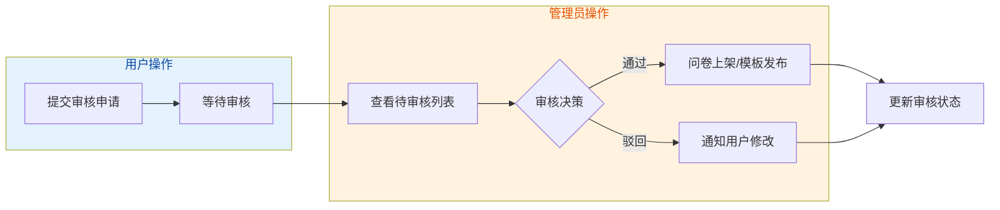
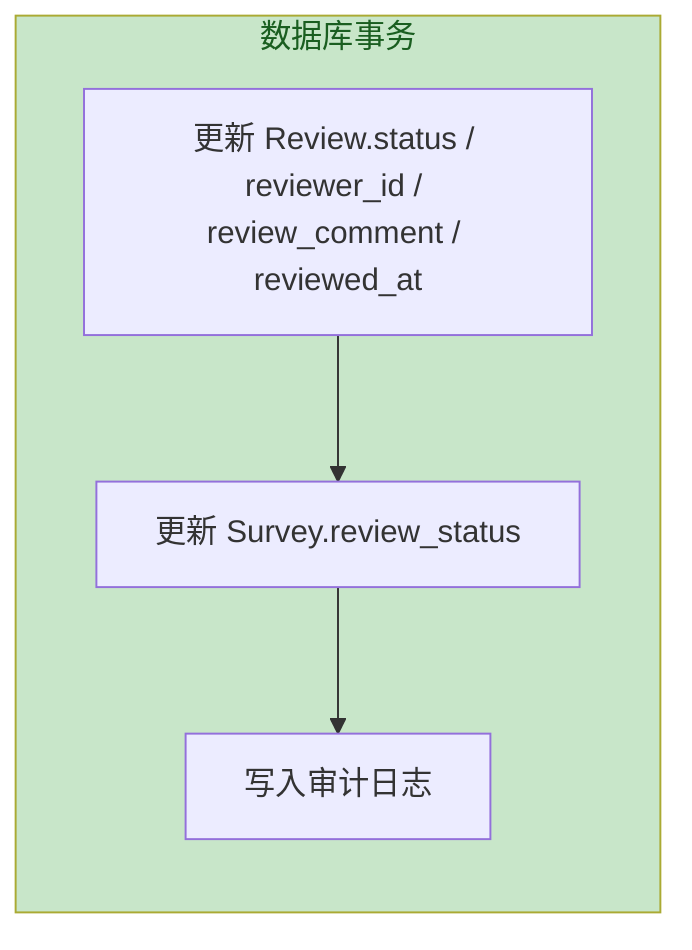
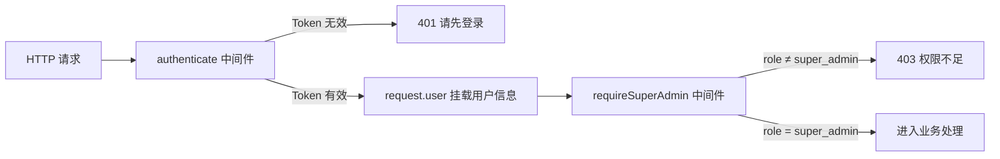
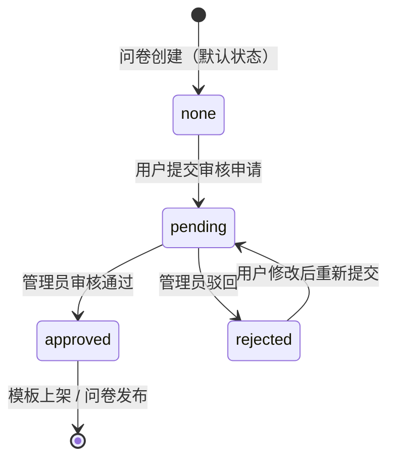
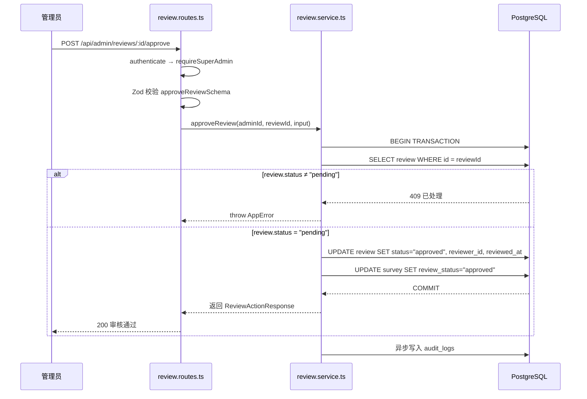

# 审核模块业务实现方案

> 版本：v1.0  
> 更新日期：2026-06-23  
> 适用范围：`app/q-server` 后端服务  
> 关联文档：[schema.prisma](../../../../prisma/schema.prisma) | [architecture.md](../../../../doc/architecture.md)

---

## 目录

- [一、业务背景与需求概述](#一业务背景与需求概述)
- [二、数据模型分析](#二数据模型分析)
- [三、审核权限控制机制](#三审核权限控制机制)
- [四、审核内容范围](#四审核内容范围)
- [五、API 路由设计](#五api-路由设计)
- [六、代码组织结构](#六代码组织结构)
- [七、公共类型声明（common 包）](#七公共类型声明common-包)
- [八、业务逻辑详解](#八业务逻辑详解)
- [九、数据流设计](#九数据流设计)
- [十、安全与合规](#十安全与合规)
- [十一、实施步骤](#十一实施步骤)

---

## 一、业务背景与需求概述

### 1.1 业务场景

问卷平台存在两类需要管理员审核的内容：

1. **用户问卷合规性审核** — 用户发布的问卷可能包含违规内容（敏感词、不当信息等），需要管理员审核后方可公开发布
2. **共享模板申请审核** — 用户将个人问卷提交为公共模板，需要管理员审核内容质量、分类合理性后方可上架模板市场

### 1.2 核心流程



---

## 二、数据模型分析

### 2.1 核心表结构

审核功能的数据库模型已在 `schema.prisma` 中完整定义，涉及两张核心表：

#### Survey 表（问卷表）— 审核状态字段

| 字段            | 类型                |   默认值   | 说明                                                    |
| --------------- | ------------------- | :--------: | ------------------------------------------------------- |
| `survey_type`   | `SurveyType` 枚举   | `personal` | 问卷类型：`personal` = 个人问卷 / `template` = 公共模板 |
| `review_status` | `ReviewStatus` 枚举 |   `none`   | 审核状态：`none` / `pending` / `approved` / `rejected`  |

**索引**（已存在，无需新建）：

```prisma
@@index([survey_type, review_status])  // 模板市场查询
@@index([survey_type, category])       // 按分类筛选模板
```

#### Review 表（审核记录表）— 完整结构

| 字段             | 类型         | 说明                                |
| ---------------- | ------------ | ----------------------------------- |
| `id`             | BigInt (PK)  | 审核记录 ID                         |
| `survey_id`      | BigInt (FK)  | 关联的问卷 ID                       |
| `submitter_id`   | BigInt (FK)  | 提交者（问卷作者）                  |
| `reviewer_id`    | BigInt? (FK) | 审核人（管理员），审核前为 null     |
| `status`         | ReviewStatus | `pending` / `approved` / `rejected` |
| `submit_message` | String?      | 提交时附加说明（最大 500 字符）     |
| `review_comment` | String?      | 审核意见（通过/驳回时填写）         |
| `submitted_at`   | DateTime     | 提交时间                            |
| `reviewed_at`    | DateTime?    | 审核完成时间                        |

**关联关系**：

```prisma
survey    Survey @relation(fields: [survey_id], references: [id], onDelete: Cascade)
submitter User   @relation("ReviewSubmitter", fields: [submitter_id], references: [id])
reviewer  User?  @relation("ReviewReviewer", fields: [reviewer_id], references: [id])
```

**索引**（已存在）：

```prisma
@@index([survey_id])           // 查询某问卷的审核记录
@@index([submitter_id])        // 查询某用户提交的审核
@@index([reviewer_id])         // 查询某管理员审核过的记录
@@index([status])              // 待审核列表筛选
@@index([submitted_at])        // 按提交时间排序
@@index([survey_id, status])   // 高频：检查同一问卷是否有审核中记录
```

### 2.2 枚举定义

```prisma
enum SurveyType {
  personal   // 个人问卷（默认，不走审核）
  template   // 公共模板（需审核通过）
}

enum ReviewStatus {
  none       // 未申请审核
  pending    // 审核中
  approved   // 已通过
  rejected   // 已驳回
}
```

### 2.3 数据一致性设计

**核心原则**：`Survey.review_status` 是 `Review.status` 的冗余字段，必须在同一事务中同步更新。



**为什么不使用 MQ/Redis 异步写入？**

- 审核是低频操作，无流量削峰需求
- 异步写入存在数据不一致风险（Redis 宕机、刷库失败）
- 事务同步写入是最简单可靠的方案

---

## 三、审核权限控制机制

### 3.1 权限模型

**当前阶段**：仅允许超级管理员（`super_admin`）参与审核操作。

**实现方式**：复用项目已有的 `authenticate` + `requireSuperAdmin` 中间件。

```typescript
// 中间件链：所有审核接口预检
fastify.addHook("preHandler", authenticate); // 1. JWT Token 校验 → request.user
fastify.addHook("preHandler", requireSuperAdmin); // 2. 角色校验 → request.user.role === "super_admin"
```

### 3.2 权限验证流程



### 3.3 精细化权限列表（后续迭代）

以下权限矩阵为后续迭代规划，**暂不纳入本次实现范围**：

| 权限码           | 说明         | 适用角色   |
| ---------------- | ------------ | ---------- |
| `review:read`    | 查看审核列表 | 超级管理员 |
| `review:approve` | 审核通过     | 超级管理员 |
| `review:reject`  | 审核驳回     | 超级管理员 |
| `review:comment` | 填写审核意见 | 超级管理员 |
| `review:history` | 查看审核历史 | 超级管理员 |

> 当前阶段所有审核操作统一由 `super_admin` 角色执行，不区分具体权限码。

---

## 四、审核内容范围

### 4.1 审核内容分类

| 审核类型       | 触发条件         | 审核内容                               | 对应 Prisma 条件                                         |
| -------------- | ---------------- | -------------------------------------- | -------------------------------------------------------- |
| 问卷合规性审核 | 用户发布问卷     | 问卷标题、描述、题目内容是否合规       | `survey_type = "personal"` + `review_status = "pending"` |
| 共享模板审核   | 用户提交模板申请 | 模板内容质量、分类合理性、是否适合公开 | `survey_type = "template"` + `review_status = "pending"` |

### 4.2 审核状态流转



### 4.3 审核决策需提供的信息

| 信息项                    | 来源                         | 说明                               |
| ------------------------- | ---------------------------- | ---------------------------------- |
| 问卷标题 `title`          | `surveys.title`              | 判断标题是否合规、有吸引力         |
| 问卷描述 `description`    | `surveys.description`        | 判断描述是否清晰                   |
| 题目列表 `components`     | `survey_components` 关联查询 | 逐题审查内容是否合规               |
| 提交说明 `submit_message` | `reviews.submit_message`     | 用户提交时附加的说明文字           |
| 模板分类 `category`       | `surveys.category`           | 仅模板审核时显示，判断分类是否合理 |
| 提交者信息 `username`     | `users` 关联查询             | 审核记录中展示提交者               |

---

## 五、API 路由设计

### 5.1 路由注册

审核模块挂载于 `/api/admin` 前缀下，与现有的 `ai-config`、`admin` 路由一起注册。

```typescript
// src/routes/index.ts 中新增
import reviewRoutes from "../modules/review/review.routes.js";
// ...
fastify.register(reviewRoutes, { prefix: "/admin" });
```

### 5.2 接口清单

| Method | Path                             | 说明                        | 请求体                               |
| ------ | -------------------------------- | --------------------------- | ------------------------------------ |
| GET    | `/api/admin/reviews`             | 获取审核列表（分页 + 筛选） | Query: `status`, `page`, `page_size` |
| GET    | `/api/admin/reviews/:id`         | 获取审核详情（含问卷内容）  | —                                    |
| POST   | `/api/admin/reviews/:id/approve` | 审核通过                    | Body: `review_comment?`              |
| POST   | `/api/admin/reviews/:id/reject`  | 审核驳回                    | Body: `review_comment`               |

### 5.3 接口详细设计

#### GET /api/admin/reviews — 审核列表

**Query 参数**：

```typescript
{
  status?: "pending" | "approved" | "rejected";  // 默认 pending
  page?: number;      // 默认 1
  page_size?: number; // 默认 10，最大 100
}
```

**响应示例**：

```json
{
  "code": 0,
  "msg": "ok",
  "data": {
    "list": [
      {
        "review_id": "1",
        "survey_id": "10",
        "survey_title": "用户体验调查",
        "survey_type": "template",
        "category": "customer",
        "submitter_name": "张三",
        "status": "pending",
        "submit_message": "这是我设计的用户体验问卷模板，请审核",
        "submitted_at": "2026-06-20T10:00:00.000Z"
      }
    ],
    "pagination": {
      "page": 1,
      "page_size": 10,
      "total": 25,
      "total_pages": 3
    }
  }
}
```

#### GET /api/admin/reviews/:id — 审核详情

**响应示例**：

```json
{
  "code": 0,
  "msg": "ok",
  "data": {
    "review_id": "1",
    "survey_id": "10",
    "survey_title": "用户体验调查",
    "survey_description": "本问卷用于收集用户对产品的使用体验反馈",
    "survey_type": "template",
    "category": "customer",
    "submitter_id": "5",
    "submitter_name": "张三",
    "status": "pending",
    "submit_message": "这是我设计的用户体验问卷模板，请审核",
    "submitted_at": "2026-06-20T10:00:00.000Z",
    "components": [
      {
        "id": "1",
        "type": "single-select",
        "config": { "title": { "status": "您的性别是？" } },
        "order_index": 0,
        "required": 1
      }
    ]
  }
}
```

#### POST /api/admin/reviews/:id/approve — 审核通过

**请求体**：

```json
{
  "review_comment": "内容合规，分类正确，同意上架"
}
```

**响应**：

```json
{
  "code": 0,
  "msg": "审核通过",
  "data": {
    "review_id": "1",
    "status": "approved",
    "reviewed_at": "2026-06-22T15:00:00.000Z"
  }
}
```

#### POST /api/admin/reviews/:id/reject — 审核驳回

**请求体**：

```json
{
  "review_comment": "问卷第3题包含敏感词汇，请修改后重新提交"
}
```

**响应**：

```json
{
  "code": 0,
  "msg": "审核已驳回",
  "data": {
    "review_id": "1",
    "status": "rejected",
    "reviewed_at": "2026-06-22T15:00:00.000Z"
  }
}
```

### 5.4 错误场景

| 场景                     | HTTP 状态码 | 业务码 | 消息                           |
| ------------------------ | :---------: | :----: | ------------------------------ |
| 未登录                   |     401     |  401   | 请先登录                       |
| 非管理员                 |     403     |  403   | 需要超级管理员权限             |
| 审核记录不存在           |     404     |  404   | 审核记录不存在                 |
| 审核记录状态不是 pending |     409     |  409   | 该审核记录已处理，无法重复操作 |
| 审核意见为空（驳回时）   |     400     |  400   | 驳回时必须填写审核意见         |

---

## 六、代码组织结构

### 6.1 目录结构

```
src/modules/review/
├── index.ts                    # 模块统一导出入口
├── review.routes.ts            # 路由定义（审核 CRUD）
├── review.schemas.ts           # Zod 请求/响应校验 Schema
├── review.service.ts           # 业务逻辑层
└── doc/
    └── review-implementation-plan.md   # 本方案文档
```

### 6.2 模块入口 `index.ts`

```typescript
/**
 * 审核模块 — 统一导出入口
 */
export { ReviewService } from "./review.service.js";
export { default as reviewRoutes } from "./review.routes.js";
export { reviewListQuerySchema, approveReviewSchema, rejectReviewSchema, reviewIdSchema } from "./review.schemas.js";
export type { ReviewListQueryInput, ApproveReviewInput, RejectReviewInput } from "./review.schemas.js";
```

### 6.3 路由层 `review.routes.ts`

遵循项目现有模式：

- 使用 `fastify.addHook("preHandler", authenticate)` + `requireSuperAdmin` 做权限控制
- 使用 `parseAndRespond` / `parseQueryAndRespond` 做 Zod 校验
- 统一使用 `reply.sendSuccess()` 返回标准响应格式

路由注册模式参考：

- [ai-config.routes.ts](../../ai/ai-config/ai-config.routes.ts) — 管理员接口模式
- [admin.routes.ts](../../user/admin/admin.routes.ts) — 管理接口通用模式

### 6.4 Schema 层 `review.schemas.ts`

```typescript
import { z } from "zod";

// ── 审核 ID 校验 ─────────────────────────────────────────────
export const reviewIdSchema = z
  .string()
  .regex(/^\d+$/, "审核记录 ID 必须为数字")
  .transform(val => BigInt(val));

// ── 审核列表查询参数 ─────────────────────────────────────────
export const reviewListQuerySchema = z.object({
  status: z.enum(["pending", "approved", "rejected"]).default("pending"),
  page: z.coerce.number().int().min(1).default(1),
  page_size: z.coerce.number().int().min(1).max(100).default(10)
});

// ── 审核通过（审核意见可选） ─────────────────────────────────
export const approveReviewSchema = z.object({
  review_comment: z.string().max(500, "审核意见最多 500 个字符").optional()
});

// ── 审核驳回（审核意见必填） ─────────────────────────────────
export const rejectReviewSchema = z.object({
  review_comment: z.string().min(1, "驳回时必须填写审核意见").max(500, "审核意见最多 500 个字符")
});

// ── 类型导出 ─────────────────────────────────────────────────
export type ReviewListQueryInput = z.infer<typeof reviewListQuerySchema>;
export type ApproveReviewInput = z.infer<typeof approveReviewSchema>;
export type RejectReviewInput = z.infer<typeof rejectReviewSchema>;
```

### 6.5 服务层 `review.service.ts`

服务层需实现的核心方法：

| 方法                                      | 说明                                 |
| ----------------------------------------- | ------------------------------------ |
| `listReviews(query)`                      | 分页查询审核列表，支持按状态筛选     |
| `getReviewDetail(reviewId)`               | 获取审核详情（含问卷完整内容）       |
| `approveReview(adminId, reviewId, input)` | 审核通过（事务更新 Review + Survey） |
| `rejectReview(adminId, reviewId, input)`  | 审核驳回（事务更新 Review + Survey） |

---

## 七、公共类型声明（common 包）

### 7.1 目录结构

```
packages/common/src/review/
└── review.interface.ts    # 审核模块前后端共享类型
```

### 7.2 类型定义 `review.interface.ts`

```typescript
// ──────────────────────────────────────────────────────────────────────────────
// 审核模块 — 前后端通用 TypeScript 类型与接口定义
//
// 所有类型严格对齐后端 Prisma schema：
//   reviews 表、surveys 表 review_status 字段
//
// 规范：
//   - BigInt 字段在 JSON 序列化后以 string 返回
//   - 枚举值与 schema 字段注释保持一致
//   - 请求/响应类型与后端 Zod Schema 一一对应
// ──────────────────────────────────────────────────────────────────────────────

// ============================================================
//  1. 枚举与字面量类型
// ============================================================

/**
 * 审核状态
 * 对应 reviews.status / surveys.review_status
 */
export type ReviewStatus = "none" | "pending" | "approved" | "rejected";

/**
 * 问卷类型
 * 对应 surveys.survey_type
 */
export type SurveyType = "personal" | "template";

// ============================================================
//  2. 审核列表项（轻量视图）
// ============================================================

/**
 * 审核列表条目
 * 对应 reviews 表 + 关联的 surveys 表信息
 */
export interface ReviewListItem {
  /** 审核记录 ID（reviews.id，BigInt → string） */
  review_id: string;
  /** 问卷 ID（reviews.survey_id） */
  survey_id: string;
  /** 问卷标题（surveys.title） */
  survey_title: string;
  /** 问卷类型：personal / template */
  survey_type: SurveyType;
  /** 模板分类（仅 template 时有值） */
  category: string | null;
  /** 提交者用户名（users.username） */
  submitter_name: string;
  /** 审核状态 */
  status: ReviewStatus;
  /** 提交说明 */
  submit_message: string | null;
  /** 提交时间（ISO 8601） */
  submitted_at: string;
}

// ============================================================
//  3. 审核详情（含完整问卷内容）
// ============================================================

/**
 * 审核详情（用于管理员查看审核内容）
 */
export interface ReviewDetail {
  /** 审核记录 ID */
  review_id: string;
  /** 问卷 ID */
  survey_id: string;
  /** 问卷标题 */
  survey_title: string;
  /** 问卷描述 */
  survey_description: string | null;
  /** 问卷类型 */
  survey_type: SurveyType;
  /** 模板分类 */
  category: string | null;
  /** 提交者 ID */
  submitter_id: string;
  /** 提交者用户名 */
  submitter_name: string;
  /** 审核状态 */
  status: ReviewStatus;
  /** 提交说明 */
  submit_message: string | null;
  /** 审核意见 */
  review_comment: string | null;
  /** 审核人 ID（审核前为 null） */
  reviewer_id: string | null;
  /** 审核人用户名（审核前为 null） */
  reviewer_name: string | null;
  /** 提交时间（ISO 8601） */
  submitted_at: string;
  /** 审核完成时间（ISO 8601，审核前为 null） */
  reviewed_at: string | null;
  /** 问卷题目组件列表 */
  components: ReviewComponentItem[];
}

/** 审核详情中的组件条目 */
export interface ReviewComponentItem {
  /** 组件 ID */
  id: string;
  /** 组件类型 */
  type: string;
  /** 组件配置（JSON 对象） */
  config: Record<string, unknown>;
  /** 排序索引 */
  order_index: number;
  /** 是否必填 */
  required: 0 | 1;
}

// ============================================================
//  4. API 请求/响应类型
// ============================================================

/** GET /api/admin/reviews — 审核列表查询参数 */
export interface ReviewListQuery {
  status?: ReviewStatus;
  page?: number;
  page_size?: number;
}

/** GET /api/admin/reviews — 审核列表响应 */
export interface ReviewListResponse {
  list: ReviewListItem[];
  pagination: {
    page: number;
    page_size: number;
    total: number;
    total_pages: number;
  };
}

/** POST /api/admin/reviews/:id/approve — 审核通过请求 */
export interface ApproveReviewRequest {
  review_comment?: string;
}

/** POST /api/admin/reviews/:id/reject — 审核驳回请求 */
export interface RejectReviewRequest {
  review_comment: string;
}

/** 审核操作响应 */
export interface ReviewActionResponse {
  review_id: string;
  status: ReviewStatus;
  reviewed_at: string;
}
```

### 7.3 在 common/index.ts 中注册

```typescript
// packages/common/src/index.ts 中新增
export * from "./review/review.interface.js";
```

> **注意**：`ReviewStatus` 和 `SurveyType` 在 `survey.interface.ts` 中已定义，审核模块的 `review.interface.ts` 重新定义这两个类型以确保模块解耦。如果未来需要统一管理枚举，可考虑抽取到 `common/src/enums.ts`。

---

## 八、业务逻辑详解

### 8.1 审核列表查询

```typescript
/**
 * 分页查询审核列表
 *
 * 查询逻辑：
 *   1. 按 status 筛选 Review 记录
 *   2. 关联查询 surveys 表和 users 表
 *   3. 按 submitted_at 降序排列（最新提交在前）
 *   4. 分页返回
 */
async listReviews(query: ReviewListQueryInput): Promise<ReviewListResponse> {
  const { status, page, page_size } = query;

  const [records, total] = await Promise.all([
    this.fastify.prisma.review.findMany({
      where: { status },
      include: {
        survey: {
          select: { title: true, survey_type: true, category: true }
        },
        submitter: {
          select: { username: true }
        }
      },
      orderBy: { submitted_at: "desc" },
      skip: (page - 1) * page_size,
      take: page_size
    }),
    this.fastify.prisma.review.count({ where: { status } })
  ]);

  return {
    list: records.map(r => ({
      review_id: String(r.id),
      survey_id: String(r.survey_id),
      survey_title: r.survey.title,
      survey_type: r.survey.survey_type,
      category: r.survey.category,
      submitter_name: r.submitter.username,
      status: r.status,
      submit_message: r.submit_message,
      submitted_at: r.submitted_at.toISOString()
    })),
    pagination: {
      page,
      page_size,
      total,
      total_pages: Math.ceil(total / page_size)
    }
  };
}
```

### 8.2 审核详情查询

```typescript
/**
 * 获取审核详情（含问卷完整题目内容）
 *
 * 查询逻辑：
 *   1. 查询 Review 记录，关联 survey、submitter、reviewer（若已审核）
 *   2. 关联查询 survey_components，按 order_index 排序
 *   3. 返回完整审核详情
 */
async getReviewDetail(reviewId: bigint): Promise<ReviewDetail> {
  const review = await this.fastify.prisma.review.findUnique({
    where: { id: reviewId },
    include: {
      survey: {
        include: {
          components: {
            orderBy: { order_index: "asc" }
          }
        }
      },
      submitter: { select: { id: true, username: true } },
      reviewer: { select: { id: true, username: true } }
    }
  });

  if (!review) throw new AppError("审核记录不存在", 404);

  return {
    review_id: String(review.id),
    survey_id: String(review.survey_id),
    survey_title: review.survey.title,
    survey_description: review.survey.description,
    survey_type: review.survey.survey_type,
    category: review.survey.category,
    submitter_id: String(review.submitter_id),
    submitter_name: review.submitter.username,
    status: review.status,
    submit_message: review.submit_message,
    review_comment: review.review_comment,
    reviewer_id: review.reviewer_id ? String(review.reviewer_id) : null,
    reviewer_name: review.reviewer?.username ?? null,
    submitted_at: review.submitted_at.toISOString(),
    reviewed_at: review.reviewed_at?.toISOString() ?? null,
    components: review.survey.components.map(c => ({
      id: String(c.id),
      type: c.type,
      config: c.config as Record<string, unknown>,
      order_index: c.order_index,
      required: c.required as 0 | 1
    }))
  };
}
```

### 8.3 审核通过（核心事务）

```typescript
/**
 * 审核通过
 *
 * 事务操作：
 *   1. 校验 Review 状态是否为 pending（防止重复审核）
 *   2. 更新 Review：status → approved, reviewer_id, reviewed_at, review_comment
 *   3. 更新 Survey：review_status → approved
 *   4. 写入审计日志（fire-and-forget）
 *
 * 事务保证 Review 和 Survey 状态一致
 */
async approveReview(adminId: bigint, reviewId: bigint, input: ApproveReviewInput): Promise<ReviewActionResponse> {
  const review = await this.fastify.prisma.$transaction(async tx => {
    // 1. 校验状态
    const existing = await tx.review.findUnique({ where: { id: reviewId } });
    if (!existing) throw new AppError("审核记录不存在", 404);
    if (existing.status !== "pending") {
      throw new AppError("该审核记录已处理，无法重复操作", 409);
    }

    const now = new Date();

    // 2. 更新 Review
    const updated = await tx.review.update({
      where: { id: reviewId },
      data: {
        status: "approved",
        reviewer_id: adminId,
        review_comment: input.review_comment ?? null,
        reviewed_at: now
      }
    });

    // 3. 更新 Survey
    await tx.survey.update({
      where: { id: existing.survey_id },
      data: { review_status: "approved" }
    });

    return updated;
  });

  // 4. 审计日志（异步）
  createAuditLog(this.fastify, adminId, "approve_review", "review", reviewId, {
    survey_id: String(review.survey_id),
    comment: input.review_comment
  }).catch(() => {});

  return {
    review_id: String(review.id),
    status: review.status,
    reviewed_at: review.reviewed_at!.toISOString()
  };
}
```

### 8.4 审核驳回（核心事务）

```typescript
/**
 * 审核驳回
 *
 * 与审核通过逻辑相同，但：
 *   - review_comment 为必填项
 *   - status 更新为 rejected
 *   - Survey.review_status 更新为 rejected
 *   - 驳回后用户可修改问卷后重新提交（rejected → pending）
 */
async rejectReview(adminId: bigint, reviewId: bigint, input: RejectReviewInput): Promise<ReviewActionResponse> {
  const review = await this.fastify.prisma.$transaction(async tx => {
    const existing = await tx.review.findUnique({ where: { id: reviewId } });
    if (!existing) throw new AppError("审核记录不存在", 404);
    if (existing.status !== "pending") {
      throw new AppError("该审核记录已处理，无法重复操作", 409);
    }

    const now = new Date();

    const updated = await tx.review.update({
      where: { id: reviewId },
      data: {
        status: "rejected",
        reviewer_id: adminId,
        review_comment: input.review_comment,
        reviewed_at: now
      }
    });

    await tx.survey.update({
      where: { id: existing.survey_id },
      data: { review_status: "rejected" }
    });

    return updated;
  });

  createAuditLog(this.fastify, adminId, "reject_review", "review", reviewId, {
    survey_id: String(review.survey_id),
    comment: input.review_comment
  }).catch(() => {});

  return {
    review_id: String(review.id),
    status: review.status,
    reviewed_at: review.reviewed_at!.toISOString()
  };
}
```

---

## 九、数据流设计

### 9.1 审核通过流程



### 9.2 重新提交审核流程（用户端）

用户在 `survey-crud.service.ts` 中重新提交时，需检查 `review_status` 是否允许重新提交：

```typescript
// 在 applyTemplate 或新建的 submitReview 方法中
if (existing.review_status === "pending") {
  throw new AppError("该问卷已有审核中的申请", 409);
}

// rejected 状态允许重新提交：
// Survey.review_status: rejected → pending
// Review 插入新记录: status = pending
```

> **注意**：重新提交逻辑在 `survey-crud.service.ts` 的 `applyTemplate` 方法中已有实现（检查 `status === "pending"` 的并发冲突），审核模块只需实现管理端的处理逻辑。

---

## 十、安全与合规

### 10.1 安全措施

| 措施             | 实现方式                                         |
| ---------------- | ------------------------------------------------ |
| **身份认证**     | JWT Token 校验（`authenticate` 中间件）          |
| **权限控制**     | 超级管理员角色校验（`requireSuperAdmin` 中间件） |
| **输入校验**     | Zod Schema 校验所有请求参数                      |
| **SQL 注入防护** | Prisma 参数化查询，不存在 SQL 拼接               |
| **并发控制**     | 事务内乐观锁检查 `status !== "pending"`          |
| **审计追溯**     | 所有审核操作写入 `audit_logs` 表                 |

### 10.2 限流配置

```typescript
// 各接口限流（参考现有模块配置）
config: {
  rateLimit: {
    max: 30,       // 每分钟最多 30 次
    timeWindow: "1 minute"
  }
}
```

### 10.3 数据合规

- 审核操作记录完整链路：操作人 (`reviewer_id`) → 操作时间 (`reviewed_at`) → 操作内容 (`review_comment`)
- 审核记录不硬删除，保留完整历史
- 问卷删除时审核记录级联删除 (`onDelete: Cascade`)

---

## 十一、实施步骤

### 步骤 1：创建公共类型声明

```
packages/common/src/review/review.interface.ts   (新建)
packages/common/src/index.ts                     (追加 export)
```

### 步骤 2：创建审核模块文件

```
src/modules/review/index.ts                      (新建)
src/modules/review/review.schemas.ts             (新建)
src/modules/review/review.service.ts             (新建)
src/modules/review/review.routes.ts              (新建)
```

### 步骤 3：注册路由

在 `src/routes/index.ts` 中追加：

```typescript
import reviewRoutes from "../modules/review/review.routes.js";
// ...
fastify.register(reviewRoutes, { prefix: "/admin" });
```

### 步骤 4：验证清单

- [ ] TypeScript 编译通过（`npx tsc --noEmit`）
- [ ] ESLint 检查通过
- [ ] 审核列表查询：支持按 status 筛选，分页正常
- [ ] 审核详情查询：返回完整问卷内容
- [ ] 审核通过：事务更新 Review + Survey，status 一致
- [ ] 审核驳回：必填 review_comment，事务更新
- [ ] 并发审核：同一审核记录不可重复处理
- [ ] 非管理员访问：返回 403
- [ ] 未登录访问：返回 401
- [ ] 审计日志：每次操作均写入 audit_logs

---

> **总结**：审核模块基于现有 Prisma 模型和中间件架构，遵循项目已有的 `routes → schemas → service` 三层代码组织模式，核心逻辑通过数据库事务保证 Review 和 Survey 状态一致性。当前阶段仅使用超级管理员角色做权限控制，精细化权限矩阵作为后续迭代规划。
