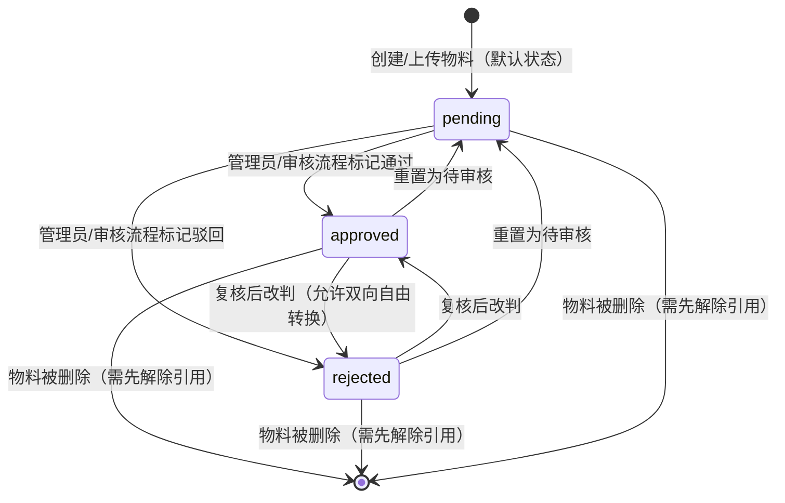

# Data Model: 物料（图片资源）管理模块

## 实体总览

| 实体         | 类型                                              | 说明                                                               |
| ------------ | ------------------------------------------------- | ------------------------------------------------------------------ |
| `MediaAsset` | 新数据模型（由既有 `SurveyFile` 重命名+扩展而来） | 被管理的单个图片资源本身                                           |
| `AuditLog`   | 复用既有模型，不新建                              | 承载每一次审核状态变更/创建/更新/删除操作的历史审计记录            |
| `User`       | 复用既有模型                                      | 物料的上传者（`user_id`）、审核状态最近一次变更者（`reviewed_by`） |
| `Survey`     | 复用既有模型                                      | 物料可选关联到的问卷（`survey_id`，可为空）                        |

## MediaAsset

由 `prisma/schema.prisma` 中的 `SurveyFile` 模型演进而来（模型重命名，`@@map` 由 `survey_files` 改为 `media_assets`）。

### 字段

| 字段             | 类型                                         | 约束                                                     | 说明                                                                                                                                                                  |
| ---------------- | -------------------------------------------- | -------------------------------------------------------- | --------------------------------------------------------------------------------------------------------------------------------------------------------------------- |
| `id`             | `BigInt`                                     | PK, autoincrement                                        | 主键                                                                                                                                                                  |
| `survey_id`      | `BigInt?`                                    | FK → Survey, `onDelete: SetNull`                         | 所属问卷；为空表示未关联到具体问卷（如用户头像）                                                                                                                      |
| `user_id`        | `BigInt`                                     | FK → User, `onDelete: Cascade`                           | 上传者                                                                                                                                                                |
| `resource_type`  | `String`                                     | `@default("image")`                                      | 底层资源类型，当前恒为 `"image"`；字符串类型为未来非图片类型预留扩展空间                                                                                              |
| `file_url`       | `String @db.VarChar(1024)`                   | 必填                                                     | MinIO 完整访问 URL                                                                                                                                                    |
| `file_key`       | `String @db.VarChar(512)`                    | 必填                                                     | MinIO 对象 key，删除时需要                                                                                                                                            |
| `file_name`      | `String @db.VarChar(255)`                    | 必填                                                     | 原始文件名                                                                                                                                                            |
| `mime_type`      | `String @db.VarChar(127)`                    | 必填                                                     | MIME 类型                                                                                                                                                             |
| `file_size`      | `BigInt`                                     | 必填                                                     | 文件大小（字节）                                                                                                                                                      |
| `file_type`      | `FileType`                                   | `@default(survey_option_image)`，新增 `user_avatar` 取值 | 沿用既有枚举，标识原始业务来源（细粒度分类，与 `resource_type` 的粗粒度"图片/未来其他类型"区分互补）                                                                  |
| `review_status`  | `ReviewStatus`（复用 `Review` 模块既有枚举） | `@default(pending)`                                      | 审核状态：`pending`/`approved`/`rejected`（`none` 值仅保留兼容枚举定义，本实体默认不产生 `none`，迁移历史数据时也归入 `pending`，确保存量内容不被排除在审核视野之外） |
| `reviewed_by`    | `BigInt?`                                    | FK → User, nullable                                      | 最近一次审核状态变更的操作者；可能是人工管理员，也可能是未来的自动化审核流程所使用的账号/身份                                                                         |
| `reviewed_at`    | `DateTime?`                                  | nullable                                                 | 最近一次审核状态变更时间                                                                                                                                              |
| `review_comment` | `String? @db.Text`                           | nullable                                                 | 最近一次审核意见/备注                                                                                                                                                 |
| `created_at`     | `DateTime`                                   | `@default(now())`                                        | 创建时间                                                                                                                                                              |
| `updated_at`     | `DateTime`                                   | `@updatedAt`（新增，原 `SurveyFile` 没有此字段）         | 最近一次更新时间                                                                                                                                                      |

### 索引（延续并扩展既有 `SurveyFile` 索引）

- `@@index([survey_id])`
- `@@index([user_id])`
- `@@index([file_type])`
- `@@index([created_at])`
- `@@index([survey_id, file_type])`（沿用）
- `@@index([review_status])`（新增，支撑管理端按审核状态筛选）
- `@@index([user_id, review_status])`（新增，支撑"某用户的待审核物料"场景）

### 校验规则（对应 spec.md Functional Requirements）

- 创建/上传：`mime_type` 必须属于图片 MIME 白名单（复用现有上传校验规则），`file_size` 不超过既有单文件大小上限（FR-011）。
- 更新：只允许更新 `resource_type` 归类、`survey_id` 关联等描述性字段，**不允许**通过更新操作替换 `file_url`/`file_key`（FR-006 —— 换文件视为新增一条记录 + 删除旧记录，而不是原地覆盖）。
- 删除：删除前必须确认该记录当前未被"有效引用"阻塞（见下方"引用检测"），否则拒绝并返回具体引用来源（FR-014）。
- 审核状态变更：`review_status` 允许在 `pending`/`approved`/`rejected` 之间自由互转（不像 `Review` 模型的提交审核流程那样要求"仅能从 pending 转出"）——因为 `MediaAsset.review_status` 是管理员/未来 Agent 可随时人工复核调整的标记，不是一次性的提交-裁决流程；每次变更都必须同步写 `reviewed_by`/`reviewed_at`，并追加一条 `AuditLog`（FR-009）。

### 审计追溯：复用 `AuditLog`，不新建历史表

`MediaAsset` 本身只保存"最近一次"审核状态变更的三个字段（`reviewed_by`/`reviewed_at`/`review_comment`），完整的历史变更序列不新建专门的历史表，而是每次创建/更新/删除/审核状态变更时，向既有 `AuditLog` 模型追加一条记录：

```
AuditLog {
  user_id:       <本次操作者>
  action:        "media_asset.create" | "media_asset.update"
               | "media_asset.delete" | "media_asset.review_status_change"
  resource_type: "MediaAsset"
  resource_id:   <MediaAsset.id>
  details:       { from_status?, to_status?, comment?, ...其他变更字段差异 }
  created_at:    <操作时间>
}
```

这样"每条物料的完整审核历史"可以通过 `AuditLog.resource_type = "MediaAsset" AND resource_id = ?` 查询还原，无需在 `MediaAsset` 之外再建一张专门的审核历史表，符合"避免重复建设"的原则，也与平台既有的审计日志机制保持一致（宪法 Principle VI）。

### 状态图



## 引用检测（支撑 FR-014）

删除操作前，需要判定该 `MediaAsset` 是否仍被"有效引用"。判定范围（按当前已知的图片消费场景枚举，未来若新增图片消费场景需要同步补充此列表）：

1. **问卷题目配置引用**：`SurveyComponent.config`（JSON）中记录了图片选择题/签名题等组件的图片 URL；需要检查是否存在任一 `Survey.status IN (0草稿,1发布)`（未被软删除、未关闭）的问卷，其 `SurveyComponent.config` 中包含该物料的 `file_url`。
2. **用户当前头像**：`UserProfile.avatar_url` 或 `User.avatar_url` 等于该物料的 `file_url`。

只要命中以上任一场景，删除请求即被拒绝，并在响应中列出具体的引用来源（问卷标题+ID，或用户信息），供管理员判断是否需要先在业务侧解除引用。

## 与既有实体的关系变化

- `Survey` 模型的 `files SurveyFile[]` 关联字段随重命名同步改为 `media_assets MediaAsset[]`；`onDelete: SetNull` 行为不变（问卷被删除时，其关联物料不会被级联删除，只是解除关联，保留物料供后续判断是否清理）。
- `User` 模型的 `survey_files SurveyFile[]` 关联字段同步改为 `media_assets MediaAsset[]`；新增反向关联 `reviewed_media_assets MediaAsset[] @relation("MediaAssetReviewer")` 对应 `reviewed_by`。
