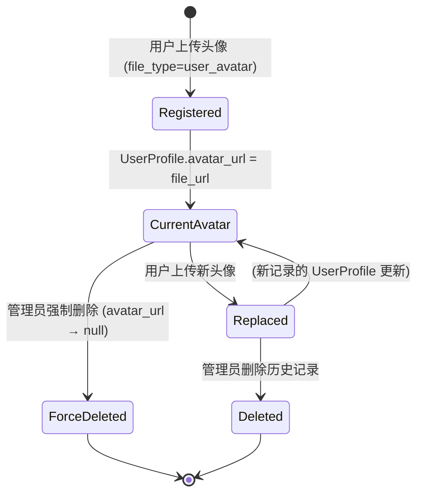
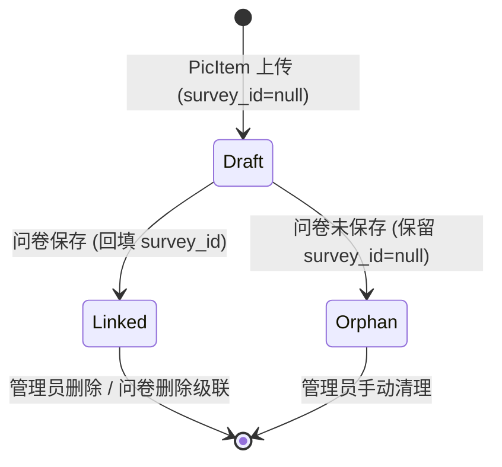

# 数据模型设计：修复物料管理模块上传追踪缺失

**Created**: 2026-07-19 | **Phase**: 1

## 变更概览

本次修复**不新增数据库表或列**，所有 schema 变更已在 `20260719120000_rename_survey_file_to_media_asset` 迁移中完成。本次仅修改 Service 层行为逻辑和接口参数约束。

## 实体变更

### MediaAsset（无 schema 变更，仅行为语义扩展）

| 属性             | 类型             |    变更     | 说明                                                                                                          |
| ---------------- | ---------------- | :---------: | ------------------------------------------------------------------------------------------------------------- |
| `id`             | BigInt (PK)      |      —      | 自增主键                                                                                                      |
| `survey_id`      | BigInt?          | ✅ 行为变更 | 原 `POST /q-editor/survey-file/upload` 要求必填 → 改为可选（允许 null）。数据库层已是 `NULL` 允许列，无需 DDL |
| `user_id`        | BigInt           |      —      | 上传者，外键 `users.id`                                                                                       |
| `resource_type`  | String ("image") |      —      |                                                                                                               |
| `file_url`       | VarChar(1024)    |      —      | MinIO 完整访问 URL                                                                                            |
| `file_key`       | VarChar(512)     |      —      | MinIO 对象 key                                                                                                |
| `file_name`      | VarChar(255)     |      —      | 原始文件名                                                                                                    |
| `mime_type`      | VarChar(127)     |      —      |                                                                                                               |
| `file_size`      | BigInt           |      —      | 字节                                                                                                          |
| `file_type`      | FileType enum    | ✅ 枚举扩展 | 新增 `user_avatar` 取值，需迁移 `ALTER TYPE "FileType" ADD VALUE IF NOT EXISTS 'user_avatar'`                 |
| `review_status`  | ReviewStatus     |      —      | pending（默认）/ approved / rejected                                                                          |
| `reviewed_by`    | BigInt?          |      —      |                                                                                                               |
| `reviewed_at`    | DateTime?        |      —      |                                                                                                               |
| `review_comment` | Text?            |      —      |                                                                                                               |
| `created_at`     | DateTime         |      —      |                                                                                                               |
| `updated_at`     | DateTime         |      —      |                                                                                                               |

### FileType 枚举（扩展）

```prisma
enum FileType {
  survey_option_image   // PicItem 封面图（编辑器 + 渲染引擎 + 管理员直接上传）
  survey_signature      // 签名图片（q-editor Signature 组件）
  survey_cover          // 问卷封面图（预留，当前未使用）
  user_avatar           // [NEW] 用户头像（avatar.service.ts 上传）
}
```

**迁移要求**: `ALTER TYPE "FileType" ADD VALUE IF NOT EXISTS 'user_avatar';`

### UserProfile 交互（avatar_url 置 null）

在强制删除头像时与 `UserProfile` 表交互：

| 操作    | SQL 等价                                                                    | 触发条件                                                                     |
| ------- | --------------------------------------------------------------------------- | ---------------------------------------------------------------------------- |
| 置 null | `UPDATE user_profiles SET avatar_url = NULL WHERE avatar_url = $deletedUrl` | `deleteMediaAsset` 且 `detectReferences` 返回包含 `type: user_avatar` 的引用 |

### Survey（survey_id 回填）

在问卷首次创建后回填临时物料的 `survey_id`：

| 操作     | SQL 等价                                                                                                                            | 触发条件                        |
| -------- | ----------------------------------------------------------------------------------------------------------------------------------- | ------------------------------- |
| 批量回填 | `UPDATE media_assets SET survey_id = $surveyId WHERE user_id = $userId AND file_type = 'survey_option_image' AND survey_id IS NULL` | `SurveyService.create()` 成功后 |

## 状态机

### 头像物料生命周期



### 问卷物料生命周期（新增 null survey_id 中间态）



## 校验规则变更

| 规则                                      | 变更前                                      | 变更后                                             |
| ----------------------------------------- | ------------------------------------------- | -------------------------------------------------- |
| `survey_id` 校验（`/survey-file/upload`） | 必填，Zod `surveyIdSchema` 解析失败返回 400 | 可选，`null` 值允许，Service 接受 `bigint \| null` |
| `file_type` 枚举 `user_avatar`            | 不存在于 DB enum（迁移未执行时）            | 必须存在，启动时日志提示                           |
| `file_type` 查询参数（`listMediaAssets`） | 不支持                                      | 可选，Zod `z.enum([...]).optional()`               |
| 头像删除引用检测                          | 与问卷图片统一阻止                          | 区分处理：头像引用 → 强制删除；问卷引用 → 阻止     |

## 索引使用

现有索引无需新增。查询分析：

| 查询                                                                | 使用索引                                                  | 说明                                       |
| ------------------------------------------------------------------- | --------------------------------------------------------- | ------------------------------------------ |
| `listMediaAssets({ file_type })`                                    | `media_assets_file_type_idx`                              | 已有，覆盖 enum 所有值包含新 `user_avatar` |
| `listMediaAssets({ user_id, review_status })`                       | `media_assets_user_id_review_status_idx`                  | 已有                                       |
| 回填 survey_id: `WHERE user_id AND file_type AND survey_id IS NULL` | `media_assets_user_id_idx` + `media_assets_file_type_idx` | 可能需组合扫描，数据量小可接受             |
| 查头像引用: `UserProfile.findFirst({ avatar_url })`                 | `user_profiles` 表索引                                    | 已有（user_id PK 即索引）                  |
