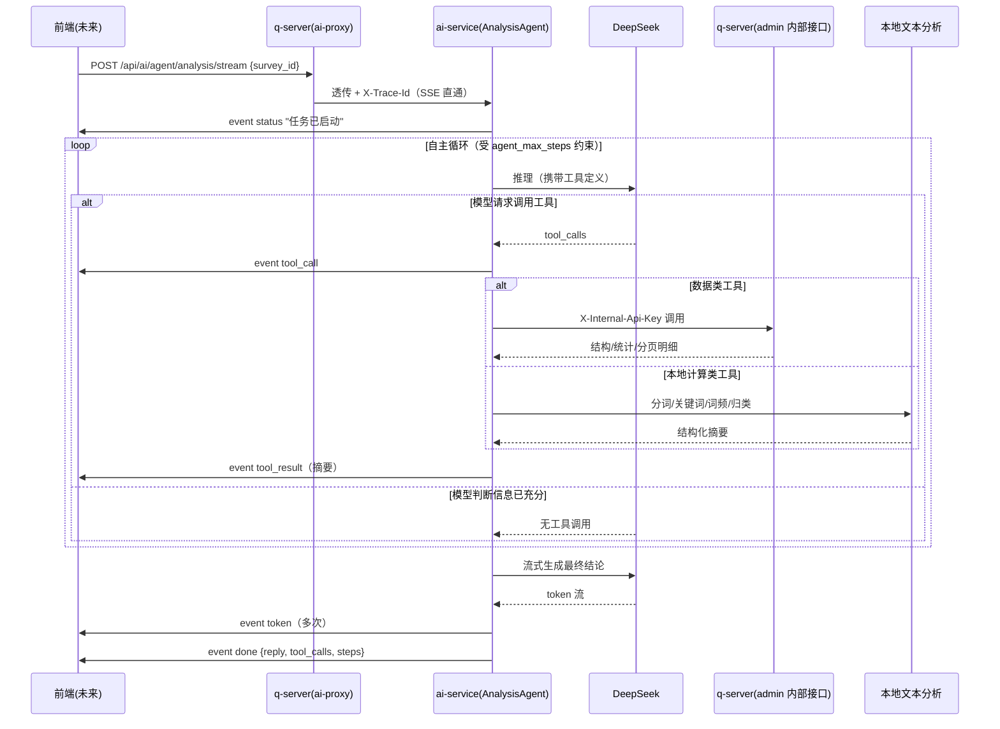

# Feature Specification: 问卷分析 Agent 自主循环方案设计

**Feature Branch**: N/A（本次交付物为方案设计文档，不创建独立分支，不生成业务代码）
**Created**: 2026-08-03
**Status**: Draft — 待评审（建议进入 `/speckit-clarify` 或 `/speckit-plan` 前先与相关方确认"关键架构决策"与"附录 A 卡点清单"）
**Input**: 用户需求（节选）："对问卷系统 AI 分析服务的端到端业务链路进行可行性验证与方案设计……核心目标：单次用户请求即可触发 Agent 自主思考循环，独立完成问卷数据拉取、文本分析、结论生成全流程，最终输出完整文字分析结果。仅做方案设计、流程可行性分析与技术规划，不生成任何业务代码。"（完整需求见会话记录）

---

## 关键架构决策（先决声明）

本方案的核心诉求——"LLM 自主判断信息是否充足，并自主决定是否/如何调用工具补充数据"——与 `app/ai-service` 当前已实现并已文档化的技术路线**直接冲突**，必须在此明确取代关系：

- **现状**：`src/agents/analysis_agent.py` 采用"确定性数据注入"模式（先固定拉取 `survey_detail` + `survey_stats`，一次性注入 Prompt，再单轮 LLM 推理/流式输出），不使用 LangChain Tool Calling。该决策记录于 `feasibility-assessment.md` §5.1/§5.3（"用 Tool 反而增加推理延迟和失败概率"），并在 `todo-list.md` 的"P0 — LangChain Tool 定义"一节被显式标记为 `[-] 跳过`。
- **本方案决定**：改为**真正的 Function Calling 自主循环**（思考 → 工具调用 → 再思考，参考 Claude Code 客户端模式），因为"迭代判断信息充分性、按需补充查询"这一能力**无法**用一次性确定性预取满足——预取多少、预取哪些题目的原始文本，本质上是需要根据问卷内容动态决定的，这正是此前方案主动放弃 Tool Calling 时未覆盖的场景。
- **影响范围**：`analysis_agent.py` 需重构为循环编排器；`survey_client.py` 需新增/修正工具方法（见附录 A 卡点 1、2）；`todo-list.md` 中"LangChan Tool 定义"跳过项需在方案落地时改为"执行"。
- **不受影响**：q-server 的 `ai-proxy` 转发层、`SurveyStatsService`、鉴权链路（`requireSuperAdmin` / `requireSuperAdminOrInternal`）均可直接复用，无需改造（详见附录 A）。

---

## User Scenarios & Testing _(mandatory)_

### User Story 1 - 管理员对指定问卷发起一次完整的自主分析并获得流式文字结论 (Priority: P1)

管理员在后台选定一份问卷后，发起一次分析请求；Agent 无需任何后续人工干预，自主完成"了解问卷结构 → 查看统计概况 → 判断是否需要更细粒度数据 → 文本预处理 → 生成结论"的全过程，最终以流式文本呈现完整分析结论。

**Why this priority**：这是本方案唯一的核心业务目标——"单次请求触发完整闭环"，是所有后续能力（自主补充查询、降级容错）存在的前提和可独立验证的最小闭环。没有这一层，方案不成立。

**Independent Test**：可直接调用 `POST /api/ai/agent/analysis/stream`（携带合法 `survey_id` 与超级管理员身份）独立验证：应收到从 `status` → 若干次 `tool_call`/`tool_result` → 若干 `token` → `done` 的完整事件序列，且 `done.reply` 为非空、与问卷内容相关的文字结论。

**Acceptance Scenarios**:

1. **Given** 一份包含单选题、多选题、开放题且已有至少 1 份答卷的问卷，**When** 管理员发起分析请求，**Then** 系统自主完成数据获取与文本处理，流式返回一段引用了具体统计数字与关键词、且与该问卷实际内容相关的文字结论，全程无需用户二次输入。
2. **Given** 同一份问卷被相隔发起两次独立分析请求，**When** 两次请求参数相同，**Then** 两次请求各自独立完成完整闭环，不共享或依赖任何前一次请求的会话状态（验证"无多轮持久化"边界）。
3. **Given** 传入的 `survey_id` 不存在或已被删除，**When** 发起分析请求，**Then** 系统在合理时间内返回明确的错误说明，而不是长时间无响应或编造分析内容。

---

### User Story 2 - Agent 在初步统计数据不足时，自主补充拉取更细粒度的原始答卷数据 (Priority: P2)

当某开放题的统计抽样（当前 `SurveyStatsService` 每题仅抽样 10 条文本）不足以支撑可靠的主题归类时，Agent 应能自主判断并发起分页查询，拉取更多原始文本样本，而不是草率地仅凭少量样本下结论。

**Why this priority**：这是本方案相较于现状"确定性单次预取"方案的核心增量价值所在，但其价值建立在 User Story 1 基础闭环已经跑通的前提之上，因此优先级次于 P1。

**Independent Test**：构造一份开放题实际答案数量远超统计抽样上限的问卷，验证 Agent 是否会自主发起分页查询工具以获取更多文本样本。

**Acceptance Scenarios**:

1. **Given** 某开放题实际有 100 份文本答案而统计接口仅返回 10 条抽样，**When** Agent 判断该样本不足以支撑可靠的主题归类，**Then** 应在步数上限内自主调用分页查询工具继续获取，最终结论应体现出对更大样本的分析结果。
2. **Given** Agent 已获取到足以支撑结论的数据，**When** 进入结论生成阶段，**Then** 不应再产生多余的工具调用，避免不必要的延迟与成本。

---

### User Story 3 - 循环步数达到上限或工具调用失败时的降级输出 (Priority: P3)

当工具调用持续失败（如 q-server 内部接口异常）或循环步数达到配置上限（`agent_max_steps`）时，系统必须基于已获得的数据给出"最佳努力"结论并明确提示局限性，而不是无响应挂起或报错中断。

**Why this priority**：属于鲁棒性保障而非核心价值本身，但缺失时会直接导致用户体验失效（卡死/无输出），必须在首个可用版本中具备最基本的兜底能力。

**Independent Test**：人为模拟 q-server 内部接口持续失败，或将 `agent_max_steps` 临时调至极小值，验证系统是否仍能返回带局限性说明的结论。

**Acceptance Scenarios**:

1. **Given** q-server 内部接口调用持续失败，**When** Agent 多次尝试获取数据均失败，**Then** 系统应在合理的重试/降级判断后，返回一段说明"数据获取受限，以下是基于有限信息的初步结论"的文字，而不是让请求无限等待。
2. **Given** 循环步数达到 `agent_max_steps` 上限但模型仍判断信息不足，**When** 触发上限，**Then** 系统必须强制进入结论生成阶段，并在结论正文中明确提示"分析基于当前已获取的数据，可能不完整"。

---

### Edge Cases

- `survey_id` 不存在或已被软删除 → 工具返回 404/空结果 → Agent 必须如实说明问卷不存在，不得编造分析内容。
- 问卷存在但零答卷 → 统计与明细工具均返回空数据 → Agent 应直接输出"暂无有效答卷数据"，不应进行不必要的多轮工具调用。
- 问卷全部为选择题（无开放文本题）→ 文本分析工具无输入可处理 → 该工具应被自然跳过，不应报错或阻塞循环。
- 单个开放题答案量极大（如上千条）→ 分页拉取与文本分析必须在步数上限内完成 → 需要合理的默认分页大小与"先看抽样、按需再深入"的默认策略（见 Assumptions）。
- DeepSeek API 超时或返回异常 → 必须产生 `error` 事件并终止流，不能无声挂起。
- q-server 内部接口调用失败（网络异常/鉴权异常）→ 工具结果需包含结构化错误信息供 LLM 感知，Agent 应能据此说明数据缺失，而非导致整个请求失败。
- 客户端在流式过程中主动断开连接 → 复用现有 `ai-proxy` 的 `AbortController` 机制，ai-service 应感知断开并及时停止后续 LLM/工具调用，避免资源浪费。

---

## Requirements _(mandatory)_

### Functional Requirements

- **FR-001**: 系统必须提供单一请求入口，接收 `survey_id`（及可选的分析侧重点文本），触发一次完整、无需用户后续交互的 Agent 自主分析闭环，并以 SSE 流式返回最终文字结论。
- **FR-002**: Agent 在每一步推理后必须自主判断是否需要调用工具获取更多数据，或信息已充分可进入结论生成；该判断过程需通过结构化状态事件对上游可见，但不要求暴露模型原始推理文本。
- **FR-003**: 系统必须提供至少以下四类 Function Calling 工具：问卷结构查询、问卷统计查询、分页答卷明细查询、批量文本分析（分词/关键词/词频/初步归类），每个工具的入参与出参必须有明确的结构化定义（见附录 D）。
- **FR-004**: Agent 自主循环必须具备硬性步数上限（复用现有配置 `agent_max_steps`），达到上限时必须基于已获得数据生成"最佳努力"结论并在结论中明确提示可能不完整，不允许无限循环或无输出。
- **FR-005**: 所有面向 q-server 的数据查询工具，必须通过已鉴权的内部 HTTP 接口（`X-Internal-Api-Key`）调用，ai-service 不允许直接访问数据库或其他数据存储（维持既有架构边界）。
- **FR-006**: 文本类答案在进入最终结论生成前，必须先经过本地分词/关键词/词频等预处理，不得将大量原始长文本直接注入 LLM 上下文。
- **FR-007**: 最终结论必须支持 SSE 流式 token 输出，且中间过程事件（工具调用、工具结果、状态提示）必须与最终结论的 token 事件在事件词表上可区分。
- **FR-008**: 当前阶段仅需支持 DeepSeek，但工具绑定与循环编排逻辑必须与具体模型厂商解耦（沿用现有 `AI_PROVIDER` 可插拔工厂模式），确保后续切换/新增模型厂商时无需改动循环编排逻辑。
- **FR-009**: 本功能范围内不得引入多轮会话持久化或跨请求的上下文记忆；`session_id` 仅用于日志/追踪关联，不用于恢复历史对话。
- **FR-010**: 当任一工具调用失败（q-server 不可达、超时、404 等）时，Agent 必须能感知失败信息并自主决定重试、更换查询方式，或在结论中说明数据缺失，不允许导致整个请求无提示中断。
- **FR-011**: q-server 侧的请求转发层（`ai-proxy`）不得新增任何 AI 业务判断逻辑，只做参数校验、鉴权与流式透传（维持现状实现）。
- **FR-012**: 系统必须新增（或确认复用）一个 ai-service 可用内部凭证访问的、返回问卷完整结构（标题+全部题目+选项）的 q-server 接口——现状 `GET /api/surveys/:id` 要求用户级 JWT 且按所有权过滤，不满足本场景（详见附录 A 卡点 2）。

### Key Entities

- **AnalysisRunContext**（分析运行时上下文）：仅存在于单次请求生命周期内，不持久化。包含 `survey_id`、`focus`（分析侧重点，可选）、`step_count`、`tool_call_history`、累积的工具结果摘要。
- **ToolCallRecord**（工具调用记录）：`tool_name`、`arguments`、`result_summary`、`step_index`、`status`（success/error）。
- **SurveyStructureSnapshot**（问卷结构快照）：`survey_id`、`title`、`questions[]`（含 `id`/`type`/`title`/`options`）。
- **SurveyStatsSnapshot**（问卷统计快照）：复用现有 `SurveyStatsService` 输出结构（逐题分布、均值/极值、文本抽样）。
- **TextAnalysisSummary**（文本分析摘要）：`keywords[]`、`word_freq[]`、`clusters[]`（见附录 E）。
- **AnalysisConclusion**（最终分析结论）：面向用户的完整文字结论，理论上其中出现的每个具体数字/结论都应可追溯到某次 `ToolCallRecord` 的结果。

---

## Success Criteria _(mandatory)_

- **SC-001**: 对任意合法 `survey_id`，用户应能在请求发起后短时间内（建议 ≤5 秒）看到第一个状态反馈（而非长时间静默等待），确认请求已被处理。
- **SC-002**: 对典型规模问卷（≤20 题、≤200 份答卷），完整分析闭环（从请求发起到结束）应能在可预期时间内完成（建议 ≤60 秒），全程不依赖用户任何额外交互。
- **SC-003**: Agent 自主循环的工具调用次数在任何情况下都被有效限制在配置上限内，不出现无限循环或无响应挂起。
- **SC-004**: 最终结论中出现的具体数字/统计描述，均可在本次工具调用结果中找到对应依据，不出现无数据支撑的臆测性数值。
- **SC-005**: 当上游任一环节（q-server 不可达、模型 API 异常）出现故障时，请求发起方能收到明确的错误反馈，而非无声中断或无限等待。
- **SC-006**: 新增或修改的 q-server 接口，与现有权限体系（用户级 JWT + 内部服务凭证两层校验）保持一致，不引入新的权限绕过路径。

---

## Assumptions

- 采用"LLM 自主 Function Calling 循环"取代现有"确定性数据注入"方案，作为本方案的核心架构决策（详见"关键架构决策"），取代 `feasibility-assessment.md` §5.1/§5.3 及 `todo-list.md` 中相应跳过项的既有结论。
- 假设分析场景仅面向"管理员分析任意问卷"，与现有 `ai-proxy` 鉴权设计（分析类接口要求 `requireSuperAdmin`）一致；不考虑"普通用户仅分析自己创建的问卷"场景——如需支持后者，需在工具层额外补充所有权校验，本方案未覆盖。
- 假设 q-server 需新增一个内部凭证可访问的问卷结构查询接口（对应 FR-012），这是本方案的前置依赖任务，属于"需要开发的后端接口"而非本次交付的业务代码，将在 `/speckit-plan` 阶段列为具体任务项。
- 假设原始答卷明细查询直接复用现有 `GET /api/admin/surveys/:id/responses`（已支持分页/筛选/内部凭证），无需为此新增接口。
- 假设文本主题归类在当前阶段（MVP）采用轻量关键词聚类方案，语义向量聚类（embedding-based，需配合已规划但未启用的 ChromaDB/RAG 能力）作为后续增强项，不在本次落地范围内。
- 假设 Agent 循环中间过程通过结构化 `status`/`tool_call`/`tool_result` 事件呈现，不直接暴露模型原始思维链文本，兼顾用户体验与信息安全。
- 假设循环步数上限沿用现有配置 `agent_max_steps=10`；同时建议新增一个总时长兜底配置（如 `agent_timeout_seconds`）作为步数上限的补充保护，避免单步耗时异常长导致整体请求耗时失控。
- 假设"先用统计抽样判断、仅当明确不足时才分页拉取更多原始数据"是默认策略，而非无条件全量拉取——避免大规模问卷导致步数/耗时失控。

---

## 附录 A：端到端业务链路可行性评估（卡点与优化建议）

> 结论先行：**三层链路（frontend → q-server → ai-service）整体架构合理、权限闭环无漏洞，可以支撑本方案目标**；但已实现代码中存在 **2 个会导致工具调用直接失败的确认性缺陷**，必须在开发阶段优先修复，否则新的自主循环从第一步就会失败。

### A.1 链路总览

```
用户浏览器（前端，未来开发）
   │  携带 survey_id，JWT
   ▼
q-server  /api/ai/agent/analysis/stream
   │  authenticate + requireSuperAdmin（仅校验一次，用户级）
   │  透传 body + X-Trace-Id，SSE 逐块转发（ai-proxy.routes.ts，现状已实现，无需改动）
   ▼
ai-service  /api/v1/agent/analysis/stream
   │  AnalysisAgent 自主循环启动
   │  工具调用回调 q-server（X-Internal-Api-Key，requireSuperAdminOrInternal）
   ▼
q-server  /api/admin/surveys/:id/stats 、/responses 等（内部凭证通道）
```

### A.2 已确认的卡点（阻断级，需在开发阶段第一时间修复）

| #   | 卡点                                                                                                                                                                                                                                                                                                                                                            | 现状证据                                                                                                                             | 影响                                                                                                                   | 建议                                                                                                                                                                                                                                                                                           |
| --- | --------------------------------------------------------------------------------------------------------------------------------------------------------------------------------------------------------------------------------------------------------------------------------------------------------------------------------------------------------------- | ------------------------------------------------------------------------------------------------------------------------------------ | ---------------------------------------------------------------------------------------------------------------------- | ---------------------------------------------------------------------------------------------------------------------------------------------------------------------------------------------------------------------------------------------------------------------------------------------- |
| 1   | `SurveyAPIClient.get_survey_responses()` 调用 `GET /api/responses?survey_id=`，该路由在 q-server 中**不存在**（已核对 `survey-crud.routes.ts` 与 `routes/index.ts` 全部注册路径，仅存在 `GET /responses/:id`、`GET /surveys/:surveyId/responses`，均非此路径+查询参数组合）                                                                                     | `survey_client.py:62-66`                                                                                                             | 任何触发该方法的调用必现 404，是当前实现里一个从未被真正跑通过的死代码路径                                             | 废弃该方法，改为新增 `list_survey_responses(survey_id, page, page_size, question_id?, keyword?)`，调用已存在且鉴权兼容的 `GET /api/admin/surveys/:id/responses`                                                                                                                                |
| 2   | `SurveyAPIClient.get_survey_detail()` 调用 `GET /api/surveys/:id`，该路由 `preHandler: authenticate`（要求用户级 JWT）且内部执行 `surveyService.getById(request.user.userId, surveyId)`（按创建者所有权过滤），而 ai-service 对 q-server 的所有回调只携带 `X-Internal-Api-Key`，**没有用户 JWT**，且该路由不支持 `requireSuperAdminOrInternal` 式的内部凭证豁免 | `survey_client.py:56-58`；`survey-crud.routes.ts:87-103`；`auth.middleware.ts`（`authenticate` 仅解析 Bearer Token，无内部凭证分支） | 生产环境下该调用会直接 401；即便伪造通过，也会被限定为"仅能查询某个特定用户名下的问卷"，与"管理员分析任意问卷"场景冲突 | 参照 `survey-stats.routes.ts` 的既有模式，新增 `GET /api/admin/surveys/:id`（挂载 `requireSuperAdminOrInternal`），返回完整问卷结构；ai-service 侧新增 `get_survey_structure()` 调用该新接口，废弃对旧 `get_survey_detail()` 的依赖（对外 API 场景仍可保留旧方法用于其他用途，不建议直接删除） |

> 补充说明：现有 `AnalysisAgent._fetch_data()`（确定性注入版本）同时依赖上述两个方法，这意味着**即便不采用本方案的自主循环架构，当前已上线的确定性分析能力本身也未被真实验证过完整跑通**（`get_survey_detail` 的鉴权问题在任何架构下都存在）。这是本次评估中最重要的发现，建议无论后续采用何种 Agent 架构都优先修复。

### A.3 已排查、确认为"非卡点"的疑似风险点

| #   | 疑似风险                                                                                                     | 排查结论                                                                                                                                                                                                                                                                                                                                                                                             |
| --- | ------------------------------------------------------------------------------------------------------------ | ---------------------------------------------------------------------------------------------------------------------------------------------------------------------------------------------------------------------------------------------------------------------------------------------------------------------------------------------------------------------------------------------------- |
| 3   | q-server → ai-service 代理层 `AI_SERVICE_TIMEOUT_MS`（默认 30s）是否会在自主循环耗时变长后提前掐断流式响应？ | 不会。该超时仅用于 `fetch()` 建立连接阶段（`ai-proxy.routes.ts:47-67`，`clearTimeout` 在 `fetch` resolve 后立即执行，位于流式读取循环之前），一旦开始读取 SSE 流，只受客户端断开或上游主动结束影响。**但部署时仍需核实反向代理（如 Nginx）自身的 `proxy_read_timeout` 等配置，避免在网络层引入隐藏超时**——这属于部署阶段的核查项，不属于代码逻辑卡点。                                               |
| 4   | ai-service → q-server 的权限链路是否存在权限绕过风险？                                                       | 不存在。前端 → q-server 走标准用户级 JWT + `requireSuperAdmin`（仅一次，在最外层完成）；q-server → ai-service 不做二次用户鉴权（仅透传 `X-Trace-Id`）；ai-service → q-server 走 `X-Internal-Api-Key`（`requireSuperAdminOrInternal`，内部通道）。整条链路只在最外层做一次用户级校验，内部服务间用共享密钥互信，边界清晰、闭环无漏洞。新增接口（卡点 2 的修复方案）只需复用同一中间件即可保持一致性。 |

### A.4 设计层面卡点（架构决策，需在方案中明确取舍）

| #   | 卡点                                                                                  | 应对方式                                                                                                                                                                                                                  |
| --- | ------------------------------------------------------------------------------------- | ------------------------------------------------------------------------------------------------------------------------------------------------------------------------------------------------------------------------- |
| 5   | 循环步数上限 `agent_max_steps=10` 已声明但从未被实际使用（现状无循环）                | 新架构中必须真正接入为循环终止条件，并设计"达到上限仍无法生成完整结论"的降级路径（见 User Story 3），否则存在死循环或用户长时间无输出的风险                                                                               |
| 6   | 大规模问卷（上千条答卷）可能导致分页拉取 + 文本分析迅速消耗步数、单次分析耗时显著增加 | 默认策略为"先用现有统计抽样（10 条/题）判断，仅当明确不足时才分页拉取更多"；分页 `page_size` 建议默认 50，单次分析全生命周期总拉取量建议设置软上限（如 500 条），超过后强制转入结论生成并在结论中说明"仅基于抽样数据分析" |

---

## 附录 B：ai-service 模块划分与职责定义

| 模块                             | 现状                                                                              | 本方案变更                                                                                                                                                                                                | 职责                                                                                                                                  |
| -------------------------------- | --------------------------------------------------------------------------------- | --------------------------------------------------------------------------------------------------------------------------------------------------------------------------------------------------------- | ------------------------------------------------------------------------------------------------------------------------------------- |
| `src/agents/analysis_agent.py`   | 确定性数据注入（单轮 LLM 调用）                                                   | **重构**为自主循环编排器                                                                                                                                                                                  | 维护 `AnalysisRunContext`，驱动"推理 → 判断是否调用工具 → 执行工具 → 再推理"循环，产出结构化 SSE 事件                                 |
| `src/tools/survey_client.py`     | 部分方法调用不存在/不兼容的端点（附录 A）                                         | **修复 + 新增**：新增 `get_survey_structure()`（对接新增的 `GET /api/admin/surveys/:id`），新增 `list_survey_responses()`（对接 `GET /api/admin/surveys/:id/responses`），废弃旧 `get_survey_responses()` | 封装对 q-server 内部接口的 HTTP 调用，是 ai-service 与数据库之间唯一的合规访问路径（不允许直连数据库，符合 Constitution Principle I） |
| `src/tools/analysis_tools.py`    | 不存在（`todo-list.md` 中已跳过）                                                 | **新增**                                                                                                                                                                                                  | Function Calling 工具声明层：将 `survey_client` 与本地文本分析函数包装为带结构化 schema 的 Tool，供模型 `bind_tools`                  |
| `src/analysis/text_processor.py` | 空模块（`todo-list.md` P1 未完成）                                                | **新增**                                                                                                                                                                                                  | jieba 分词、停用词过滤、关键词提取、词频统计（详见附录 E）                                                                            |
| `src/analysis/topic_grouping.py` | 不存在                                                                            | **新增（MVP 轻量版）**                                                                                                                                                                                    | 基于关键词的轻量主题聚类（详见附录 E），后续可升级为向量语义聚类                                                                      |
| `src/llm/prompts/analysis.py`    | 面向"确定性注入"的 Prompt 模板                                                    | **改造**                                                                                                                                                                                                  | 调整为面向"自主循环"的 System Prompt：说明可用工具清单、终止条件、禁止编造未在工具结果中出现的数据的约束                              |
| `src/models/schemas.py`          | 已定义通用 `AgentStreamEvent`（`token`/`tool_call`/`tool_result`/`done`/`error`） | **扩展**                                                                                                                                                                                                  | 为 `tool_call`/`tool_result` 的 `data` 字段补充具体结构定义（附录 D、F）                                                              |
| `src/config.py`                  | 已有 `agent_max_steps`（未使用）                                                  | **激活 + 建议新增** `agent_timeout_seconds`                                                                                                                                                               | 循环终止条件的集中配置                                                                                                                |
| `src/api/routes/analysis.py`     | 现状已实现路由骨架                                                                | **无需改动**                                                                                                                                                                                              | 路由层仅做请求转发到 Agent，不感知内部是确定性注入还是自主循环                                                                        |

**模块边界原则**（承接 Constitution Principle I）：ai-service 内部任何模块都不得直接访问 PostgreSQL/Redis 等 q-server 拥有的数据存储；所有数据获取必须经由 `survey_client.py` 封装的、携带 `X-Internal-Api-Key` 的 HTTP 调用完成。

---

## 附录 C：Agent 自主循环详细执行步骤与时序说明

### C.1 执行步骤（文字版）

0. **请求到达**：`POST /api/v1/agent/analysis/stream`，body 建议为 `{"survey_id": "123", "focus": ""}`（`focus` 为可选的分析侧重点，留空表示"全面分析"）。
1. **初始化**：构造 System Prompt（含工具清单、终止条件、数据引用约束说明）+ 首条用户指令"请对问卷 {survey_id} 的作答数据做全面整理分析"；`step = 0`；yield `status`（"任务已启动"）。
2. **推理**：调用 `model.bind_tools([...]).ainvoke(messages)`。
   - **若模型返回工具调用请求**：对每个请求的工具，yield `tool_call` 事件 → 执行对应工具（HTTP 类工具走 `survey_client`；本地计算类工具走 `analysis` 模块）→ 将结果封装为 `ToolMessage` 追加到消息列表 → yield `tool_result` 事件（结果需摘要/截断，不直接向前端回显全部原始数据）→ `step += 1`。
     - 若 `step < agent_max_steps`：回到步骤 2 继续推理。
     - 若 `step >= agent_max_steps`：跳过后续推理，强制进入步骤 3（降级模式，Prompt 中追加"请基于已有信息给出结论，并说明可能不完整"）。
   - **若模型未返回工具调用**（判断信息已充分）：进入步骤 3。
3. **结论生成**：基于累积的完整消息列表，以 `model.astream(messages)` 方式流式生成最终文字结论，逐 token yield `token` 事件。
4. **结束**：yield `done` 事件，携带 `session_id`、完整 `reply`、`tool_calls` 汇总列表、`steps` 计数。
5. **异常兜底**：任一环节抛出未预期异常（模型 API 异常、工具执行异常且无法降级）→ yield `error` 事件并终止流；客户端断开 → 依赖现有 `ai-proxy` 的 `AbortController` 信号中止后续调用。

### C.2 时序图（Mermaid，用于文档可视化，非可执行代码）



---

## 附录 D：Function Calling 工具设计与接口定义

> 工具分两类：**数据类工具**（HTTP 转发到 q-server，需内部凭证）与**本地计算类工具**（纯 Python 执行，无网络调用）。以下仅为接口/schema 定义，不包含具体实现代码。

### D.1 `get_survey_structure`（数据类）

- **用途**：获取问卷元信息与题目结构，供 Agent 理解问卷内容、生成分析框架。几乎每次循环的第一步都会调用。
- **底层依赖**：q-server **新增** `GET /api/admin/surveys/:id`（挂载 `requireSuperAdminOrInternal`，对应 FR-012，见附录 A 卡点 2）。
- **入参 Schema**：

  | 字段        | 类型   | 必填 | 说明         |
  | ----------- | ------ | ---- | ------------ |
  | `survey_id` | string | 是   | 问卷唯一标识 |

- **出参结构**：`{ survey_id, title, description, questions: [{ id, type, title, required, options? }] }`

### D.2 `get_survey_stats`（数据类）

- **用途**：获取逐题聚合统计（单/多选分布、数值均值/极值、文本抽样），是判断"是否需要更深入查询"的主要依据。
- **底层依赖**：已存在 `GET /api/admin/surveys/:id/stats`（`SurveyStatsService`），无需改动。
- **入参 Schema**：`{ survey_id: string（必填） }`
- **出参结构**：复用现状 `SurveyStatsService` 输出（逐题分布 + 每题最多 10 条文本抽样）。

### D.3 `list_survey_responses`（数据类）

- **用途**：当统计抽样不足以支撑可靠结论时，分页拉取更多原始答卷/答案明细，可按题目/关键词筛选。
- **底层依赖**：**替换**现状失效的 `get_survey_responses`，改为调用已存在的 `GET /api/admin/surveys/:id/responses`（分页/搜索/筛选，`requireSuperAdminOrInternal`）。
- **入参 Schema**：

  | 字段          | 类型    | 必填 | 默认值 | 说明                                   |
  | ------------- | ------- | ---- | ------ | -------------------------------------- |
  | `survey_id`   | string  | 是   | -      | 问卷唯一标识                           |
  | `page`        | integer | 否   | 1      | 页码                                   |
  | `page_size`   | integer | 否   | 50     | 单页数量，上限 100（防止单次拉取过大） |
  | `question_id` | string  | 否   | -      | 按题目筛选                             |
  | `keyword`     | string  | 否   | -      | 文本内容搜索                           |

- **出参结构**：`{ total, page, page_size, items: [{ response_id, submitted_at, answers: [{ question_id, value }] }] }`
- **调用时机约束**：Agent 应仅在判断 `get_survey_stats` 返回的抽样明确不足时才调用本工具（默认策略，见 Assumptions），避免无条件全量拉取。

### D.4 `analyze_text_batch`（本地计算类，无网络调用）

- **用途**：对一批开放题文本做分词、关键词提取、词频统计、初步主题分组，将大段原始文本压缩为结构化摘要，避免直接把原始文本灌入 LLM 上下文。
- **入参 Schema**：

  | 字段    | 类型     | 必填 | 默认值 | 说明                        |
  | ------- | -------- | ---- | ------ | --------------------------- |
  | `texts` | string[] | 是   | -      | 待分析的原始文本列表        |
  | `top_k` | integer  | 否   | 20     | 返回的关键词/词频条目数上限 |

- **出参结构**：`{ keywords: [{ word, weight }], word_freq: [{ word, count }], clusters: [{ label, sample_texts, count }] }`
- **实现方案**：见附录 E。

### D.5 工具调用契约的通用约束

- 所有工具的出参必须是可 JSON 序列化的结构化数据，禁止直接返回未处理的超长原始文本块（大文本必须先摘要/截断）。
- 每次工具调用无论成功或失败都必须产生 `ToolMessage` 反馈给模型；失败时的 `ToolMessage` 需包含 `{ error: true, message: "..." }`，使模型能感知失败并自主决定下一步（重试/换工具/放弃并在结论中说明）。
- 工具绑定层（`analysis_tools.py`）与模型厂商解耦：工具 schema 定义与 `AI_PROVIDER` 无关，仅在 `llm/factory.py` 中通过 `bind_tools()` 统一接入，天然满足 FR-008 的模型可扩展性要求。

---

## 附录 E：文本分析模块实现方案

| 能力       | 技术选型                                                                | 说明                                                                                                                                                                                      |
| ---------- | ----------------------------------------------------------------------- | ----------------------------------------------------------------------------------------------------------------------------------------------------------------------------------------- |
| 分词       | `jieba`（已在 `pyproject.toml` 的 analysis 可选依赖组中）               | 中文分词，配合自定义停用词表（通用中文停用词 + 问卷领域常见虚词）                                                                                                                         |
| 关键词提取 | `jieba.analyse`（TF-IDF）                                               | MVP 阶段优先选用，无需额外训练/模型加载，速度快、依赖少；不采用 TextRank（依赖图计算，收益不确定）                                                                                        |
| 高频词统计 | `collections.Counter`                                                   | 分词后按词性过滤（保留名词/动词/形容词，过滤虚词/停用词），取 top_k                                                                                                                       |
| 主题归类   | MVP：基于关键词的轻量聚类（按共现关键词分组，标签直接使用代表性关键词） | 不引入向量模型/embedding，保持本地计算、无额外网络调用与延迟；后续增强阶段（见附录 G Phase 5）可升级为 embedding + 聚类算法（KMeans/HDBSCAN），依赖已规划但当前未启用的 ChromaDB/RAG 能力 |
| 情感分析   | 不在本次范围内                                                          | `todo-list.md` P2 已规划独立的 `sentiment.py`，与本方案的"文字分析结论"目标解耦，作为后续增强项                                                                                           |

**设计原则**：文本分析模块是**纯本地 CPU 计算**（无网络调用），对应附录 D.4 的"本地计算类"工具；其存在的核心目的是在数据进入 LLM 上下文之前完成降维（原始文本 → 结构化摘要），直接呼应用户需求中"数据处理"步骤，也是缓解既有 `feasibility-assessment.md` 中提出的 token 超限风险的关键手段。

---

## 附录 F：流式输出对接方案

### F.1 SSE 事件词表（扩展自现有 `AgentStreamEvent` 注释）

| event         | data 结构                                  | 说明                                                                                  |
| ------------- | ------------------------------------------ | ------------------------------------------------------------------------------------- |
| `status`      | `{ text }`                                 | 阶段性状态提示（如"正在获取问卷结构""正在分析文本"）                                  |
| `tool_call`   | `{ name, args, step }`                     | 工具调用发起，`step` 为当前循环步数                                                   |
| `tool_result` | `{ name, step, summary }`                  | 工具调用结果摘要（大结果需截断/摘要，不直接回显全部原始数据，兼顾传输体积与数据安全） |
| `token`       | `{ text }`                                 | 最终结论逐 token 增量输出                                                             |
| `done`        | `{ session_id, reply, tool_calls, steps }` | 完整结束，`reply` 为拼接后的完整结论                                                  |
| `error`       | `{ message }`                              | 异常终止                                                                              |

### F.2 与现有代理层的兼容性

现有 `app/q-server/src/modules/ai-proxy/ai-proxy.routes.ts` 对 `/stream` 结尾路径采用"逐块透传原始字节，不做任何解析"的转发策略（读取循环直接 `reply.raw.write(value)`），因此新增的 `tool_call`/`tool_result`/`status` 事件**天然兼容，q-server 侧无需任何改动**。

### F.3 前后端契约（预留，供未来前端对接）

- **请求**：`POST /api/ai/agent/analysis/stream`，body：`{ "survey_id": "123", "focus": "" }`（`focus` 可选）。
- **鉴权**：沿用现状——需登录 + 超级管理员权限（`requireSuperAdmin`），与现有分析类接口一致，无需新增鉴权设计。
- **响应**：标准 SSE（`Content-Type: text/event-stream`），前端建议按 `event` 名分别渲染：`status`/`tool_call`/`tool_result` 汇总为"处理进度提示条"，`token` 累加渲染为结论正文，`done` 标记结束并可展示 `tool_calls` 汇总（如"本次分析共查询 3 次数据、处理 2 批文本"），`error` 展示错误提示。
- **非流式对等接口**：`POST /api/ai/agent/analysis`（同步）在本方案下语义不变——等待循环完整结束后一次性返回 `{ session_id, reply, tool_calls, steps }`，仅内部实现从"单轮调用"变为"驱动完整循环后取最终结果"。

---

## 附录 G：开发优先级与落地步骤建议

> 排序原则：先修复阻断性缺陷，再实现核心循环骨架，再补齐数据处理能力，最后补齐鲁棒性与可观测性。与 `todo-list.md` 现有 P0-P3 体系兼容，可直接作为其新增/修订条目。

### Phase 0（阻断级前置修复，必须最先完成）

- q-server 新增 `GET /api/admin/surveys/:id`（内部凭证可访问的问卷结构接口，对应 FR-012 / 附录 A 卡点 2）。
- ai-service 修复 `survey_client.py`：新增 `get_survey_structure()`、`list_survey_responses()`，废弃失效的 `get_survey_responses()`（附录 A 卡点 1）。

### Phase 1（核心循环骨架）

- 新增 `src/tools/analysis_tools.py`：将上述数据类工具 + 本地文本分析工具声明为 Function Calling Tool。
- 重构 `src/agents/analysis_agent.py`：实现 `bind_tools` + 显式循环（`while step < agent_max_steps`），替换现有确定性注入实现。
- 扩展 `src/models/schemas.py` 与流式实现：补齐 `tool_call`/`tool_result`/`status` 事件的结构化 data。
- 改造 `src/llm/prompts/analysis.py`：加入工具清单说明、终止条件说明、"禁止编造未在工具结果中出现的数据"的约束。

### Phase 2（文本分析能力）

- 实现 `src/analysis/text_processor.py`（jieba 分词 + 停用词过滤 + TF-IDF 关键词 + 词频统计）。
- 实现 `src/analysis/topic_grouping.py`（MVP 关键词聚类）。
- 接入为 `analyze_text_batch` 工具并纳入 Agent 循环。

### Phase 3（鲁棒性）

- 工具调用失败的结构化错误反馈 + 必要的重试策略（可复用 `todo-list.md` P1 中已规划的 `tenacity` 重试能力）。
- 达到 `agent_max_steps` 时的降级结论生成（User Story 3）。
- 建议新增 `agent_timeout_seconds` 配置作为总时长兜底。

### Phase 4（安全与可观测性，复用现状为主）

- 确认新增接口正确复用 `requireSuperAdminOrInternal`，不引入新鉴权分支。
- 补充 `X-Trace-Id` 在工具调用日志中的贯穿记录，便于跨服务问题排查。

### Phase 5（后续增强，非本次方案范围，仅记录路线）

- 语义向量聚类升级（embedding + ChromaDB，`todo-list.md` P2 已规划的 RAG 能力）。
- 情感分析（`todo-list.md` P2 `sentiment.py`）。
- 结论数值引用的自动核验（对照工具原始结果做偏差校验）。

**与现有 `todo-list.md` 的关系**：Phase 0/1/2 对应将 `todo-list.md` 中"P0 — LangChain Tool 定义"由 `[-] 跳过` 改为 `[✓] 已完成`，并新增本方案引入的 `list_survey_responses`/`get_survey_structure`/`analyze_text_batch` 等具体条目；建议在方案评审通过后同步更新 `todo-list.md` 与 `feasibility-assessment.md` §5，避免文档与实际架构决策脱节。
